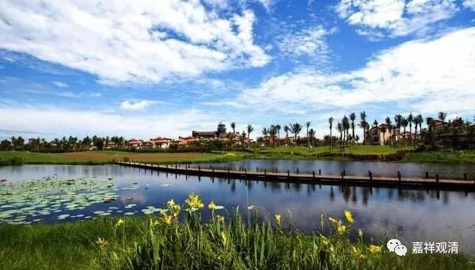

**《菩提速道》讲记032（上）**

** **

的确有这种说法，说上师融入自己，好像自己变成了上师佛。这还是有些密宗的背景。

** “有说，若主要修习寂止，到了正修寂止的阶段，则不像现在未到的时候，（而是）可以依于自成的鲜明上师能仁身为所缘境而修寂止。”**观想在自己的面前是释迦牟尼佛这个样子的上师，或者安住在师父的这个境上去观想，这样子就可以了。

** “观想从自己鲜明显现的上师能仁身中放光，照触周围的一切有情，把一切有情皆安立于能仁的宝位。”**

** **

让一切有情都成佛，这是什么意思呢？前面不是在讲“我以所修施等诸资粮,为利有情故愿大觉成”吗？或者“为利有情愿成佛”吗？前面的时候上师能仁在放光，那么，我成佛了怎么样呢？我就自成本尊，或者自己变成上师佛，变成上师能仁了。因为是“为利众生愿成佛”，那就要做利众生的事情，于是自己就放光了……成佛了就要放光利益众生了嘛。

这个只是想而已啊，你千万别真以为自己已经成佛了啊。有些人学密宗的时候就老是搞不懂，可能也是文化水平太差的原因吧。看到要生起“佛慢”，就自认为成佛了，这已经不仅仅是“慢”心的问题，这个不是慢心，这个是蠢！真的以为自己观想了以后，就成佛了——这个是愚蠢地傲慢！数数自己多少烦恼吧？可能连烦恼有哪些都还没背过呢。

真的，有些“大师”连什么是五蕴、十二处、十八界都没搞清楚就已经洋洋洒洒写了几十卷注疏了，也有些大居士四加行都没整明白就已经出了啥啥斋全集了——佛菩萨有这么不学无术的吗？！

