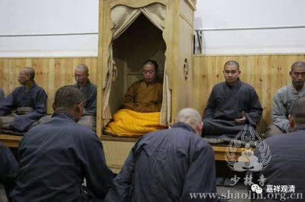

**《菩提速道》032（中）**

这只是观想，观想自己已经成了佛世尊。成佛了就得干你的事，你成佛是为了度众生，周围无量无边的众生怎么办呢？再观想自己放光，照耀一切众生，然后一切众生的脑袋顶上也都有一尊上师佛，降下去融入——好，他们也都成佛了。搞定，可以喝茶了！

这个只是想一想，接下去还得继续修。想一想的好处就类似于催眠，是吧？催眠就是一次一次地进行，一次一次地由催眠医师对被试（被进行试验的人）进行催眠，到最后就会很快，一弹指就被催眠了。

我们也是一样，每天每天地给自己催眠，到最后一上座眼睛一闭，就开始了——“面前空中狮子莲月座”就都出来了，是吧？差不多就是这样。被催眠可能比自我催眠要快多了，但是你去找一个催眠师比较不容易嘛，也没有那么多的催眠活佛来帮你催眠。

其实录音还是会有点帮助的，假如每天都搞一个3D的片子，放在面前看着，然后那个赵忠祥的声音出现了：“北极熊……”这种比较磁性的声音，好处还是有的。我以前说过吧？曾经在上海精神病院听心理学老师上现场课的时候，那位老师给上师大的学生会副会长催眠就很简单，因为他们已经进行过长期的催眠，直接就是：“我拍三下，你就睡着了。”结果，“一、二、三”，这样就被催眠了。

我们的情况也有点像这样，等于是长期地打坐、长期地观修。观习惯了，一上座，一想起来，就会完全任运地进入禅定当中。这个真的和催眠有点像。等于是你先设定一个主题，再设定入定多少时间：“待会吃饭的铃声响起的时候，我就出定。”如果吃饭的铃声永远不响，就永远不出定了。这也是催眠的一个“锁”。

不是出现过这种事情吗？结果吃饭的铃声还没响起，就有强盗上山，冲进来。整个寺院的和尚全部逃走了，他还在那里坐着，出不了定，因为之前设定的密码实在是自己没想到的情况。后来，这个寺院破败了……很久以后，又有人再建这个寺院，重新开始寺院的钟板仪式——打梆吃饭。一打梆，他就出定了，然后就死了。

