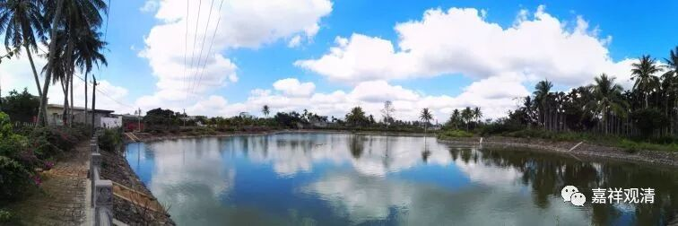

**《菩提速道》讲记033**

** **

** “一切有情若能远离痛苦及痛苦之因，该有多好！惟愿能够远离，我当令远离，祈求上师本尊加持令我具此能力。这是修习悲心。**

** 一切有情若能不离善趣及解脱的胜乐，该有多好！愿不远离，我当令不远离，祈求上师本尊加持令我具此能力。这是修习喜心。”**

** **

释迦能仁——释迦牟尼佛在菩提树下最后对付魔军的时候，用的就是这个四无量定——慈、悲、喜、舍四无量定。所以南传就比较强调四无量定，但是藏传佛教的法师们会不会承认四无量定是成佛的近取因呢？我估计是不承认的。

** “这样祈求以后，观想一切资粮田诸尊身分中降下五彩光明甘露，”**如果之前观想一尊佛的话，这里就是一尊喽。观想一尊其实挺简单的，他就是一切佛菩萨的总集，或者他就是一切佛菩萨的代表，他就代表了那么多。反正他的一切身份当中，这个也代表，那个也代表，对吧？这也是可以的嘛。

** “注入自他一切有情身心之中，无始以来所集的一切罪障，尤其障碍自他有情修习四无量心的一切病魔罪障皆得以清净，”**想，现在我在修四无量心的时候，在修四无量定的时候，关于修四无量心、四无量定的这些障碍全部都消除——这和前面都一样。

** “身体变为莹澈的光明之体，一切寿命福德教证功德皆得以增长，特别是，自他一切有情皆安住于四无量心之中。”**这也是和前面一样，特别是关于四无量心的成就，想自他都依此而获得了。

当然了，实际修四无量心并不是修这个，这是观想我消除了修四无量心方面的障碍，获得了修四无量心方面的加持，但实际修四无量心并不是这个操作法。这个最多是个修四无量定的前行，或者也可以作为修四无量定的一个结行。

那么真正地修四无量心，是需要另外观想的。比如说，在面前观想出母亲或者亲人，再观想出仇人，再观想出中庸的人。这样一步步下去，从一个村子的人，到一个镇的人，到一个小区的人，是吧？然后一个市的人，一个省的人……人越来越多，最后到四大洲，可能到四天下吧——这才是正行。

而这里说的障碍消除和获得加持，可以作为修四无量心的加行，或者是结行也行（就是修完了以后祈请获得这样的加持）。在道次第观修里面，这一段是观修道次第里的加行部分。

