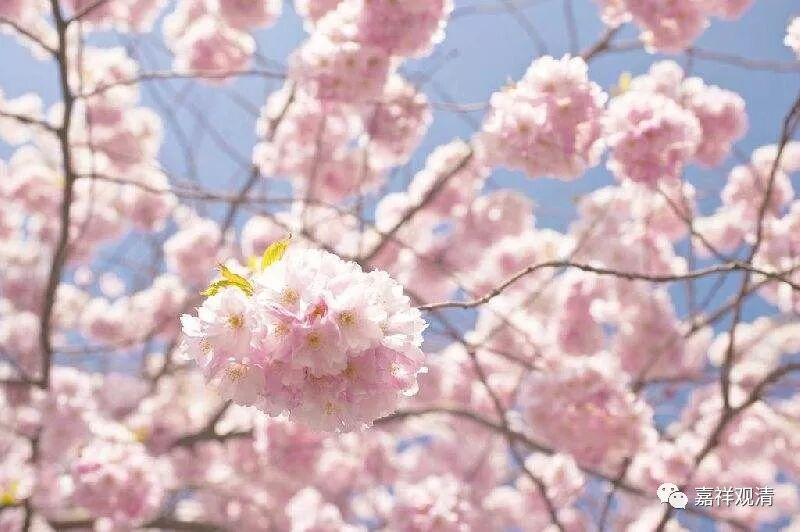

**《菩提速道》033（下）**

** “宗喀巴大师曾说：‘故于听闻不能持文，思惟不能解义，修习相续不生，慧力至极微劣时，依福田力是要教授。’”**

** **

“不能持文”，就是听了以后持不住，记不住。“思惟不能解义”，就是想半天，连脑子想破了，也想不出来。“修习相续不生”，是在那里修习半天，心里总是达不到那个量、那个标准。“慧力至极微劣时”，感觉自己脑子不够用，再吃什么“脑白金”也没用。

这个时候怎么办呢？“依福田力是要教授。”这个是什么意思呢？如果我们转换成现代的语言就是：当你觉得自己的力量已经发挥到极限的地步了，即使花了很长时间也没有突破的时候，那就是你自己的力量不够，就应该求加持！

但是，有的时候弟子来求我：“师父，我反正想不出来了，你告诉我就好了。”

我就回答：“我不是告诉你了嘛？要自己想，这就是‘要教授’！”

“师父，还是想不出怎么办？”

“想不出，就继续想。”

单纯求加持而自己却不努力，这也不行啊。我们小时候就学过嘛——外因通过内因起作用。

其实，作为知识分子，经常忘记“求加持”，光想着自己解决."自己努力"和"请人帮忙",对成长来说,这也似乎确实是一对矛盾，或者说:要达到中道很难。我们是以他力——以求加持为主呢，还是以自力——以自己用功为主呢？可能还是要找到中道，因为我觉得这两点都需要。当然，有时候我们会特别强调其中的一点，比如禅宗就强调修行都要靠自己，而密宗就讲修行全都靠上师加持。那我们现在大概最好是是禅、密结合（哈哈）。

这里反复地出现“上师瑜伽”，其实“上师瑜伽”就有点像我昨天终于交稿的论文，到后来就变成一种程式了、有一种套路了——这些仪轨都可以隶属于上师瑜伽，甚至你修大威德金刚、修文殊菩萨，都可以放到上师瑜伽里来修。因为修习的对象其实都是师父——你可以这么理解嘛，都可以当作上师瑜伽来修。这中间的“上师住在你心间”，如果你是修文殊菩萨的话，“啪”的一转，就像电影里面的火光一现，上师就变成文殊菩萨了，再火光一现，又变大威德金刚了……它的核心就是，你所修的所有对象，都是上师能仁。

