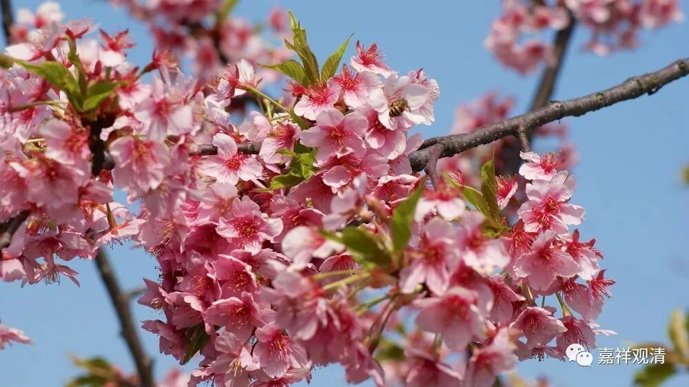

**《菩提速道》讲记034**

从这个角度来说，也就是前面所讲的，其实你都可以理解为一切佛菩萨的总集——都是他，也只是他，有时候表现的是上师的样子，有时候表现的是其他各种样子。

你如果很厉害的话，比如说你达到了克珠杰大师的那个水平，可能你在路上买一个桔子的时候，会突然觉得：“咦？卖桔者是上师的化现。”一开始我看宗大师传记的时候也不懂这段，里面说克珠杰大师在晚上猛烈地祈祷，然后就梦到一个骑着狮子的样子：“哦，宗喀巴大师来了。”我觉得奇怪：你怎么会知道是宗喀巴大师呢？这明明是骑着狮子的某位菩萨，甚至可能连文殊菩萨都不是哦，是叫什么“五秘密显现”（我记不清了，反正差不多这个意思）。后来我才明白，对克珠杰大师来说，所有这些特殊的显现，他心里面的第一反应都是翻译为：“师父来了，师父给我启示了。”

这就像禅宗里面的一个故事，一位禅师在走路的时候，看到边上有一个卖肉的商贩。一个买肉的人过来说：“给我来块精的肉，来块瘦的。”那个卖肉的屠夫就回答说：“哪块不是瘦的？！”结果路过的那位禅师马上就开悟了。

这个事情如果发生在克珠杰大师身上，他的第一反应就是：“啊？这个屠夫又是我师父！”在他的眼里看起来，大概就是宗喀巴大师戴着帽子，手里拿着把刀：“哪块不是精的？！”……实际上只要是能给他帮助的，在他眼里都是师父的化现。他的第一反应就是：“啊！这句话说得太好了！我明白了啥啥啥道理！我师父又化成屠夫来指点我了。感恩！礼拜！”

所以对克珠杰大师这样的人来说，什么都是“上师供”，什么都是“上师瑜伽”、上师相应法。如果单独来说呢，这个是黄文殊菩萨的仪轨，那个是黑文殊菩萨的修法、这个是四臂观音菩萨的修法等等。但是对于会修的人来说，这些全部都可以理解为上师相应法。

