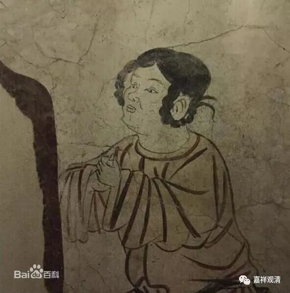

**唐幽州盘山宝积禅师悟道因缘**

宝积禅师是马祖道一禅师的弟子。

有一次，他有事路过街市，走到肉摊儿附近。正有人买肉。

那人对老板说：“老板，切一斤精肉来！”

肉摊儿老板把刀撂下，给对方作了个揖，说道：“领导，那个不是精的？！”……

禅师一闻之下，竟对所学有所领悟！

有一次又有事儿出门（他是买菜的还是知客？）……这次路上遇到抬着棺材举丧的。

有摇着铃唱的：“夕阳必定西落去，不知魂灵去哪方？”

白旗下面的孝子还在哭着：“哎哎……”

宝积禅师却听的身心踊跃，大悟宗门之旨！

回去找师父马祖道一禅师印证，师父印证了他的证悟境界！

这个故事告诉我们——

经常出门逛逛有好处，不定哪件事就开悟了（哈哈……）

出处：《五灯会元》

幽州盘山宝积禅师，因于市肆行，见一客人买猪肉，语屠家曰：“精底割一斤来！”

屠家放下刀，叉手曰：“长史！那个不是精底？”师于此有省。

又一日出门，见人舁丧，歌郎振铃云：“红轮决定沉西去，未委魂灵往那方？”

幕下孝子哭曰：“哀哀！”

师忽身心踊跃，归举似马祖，祖印可之。

** 注、叉手，是唐朝时的礼仪，类似打躬、作揖。如下图**

