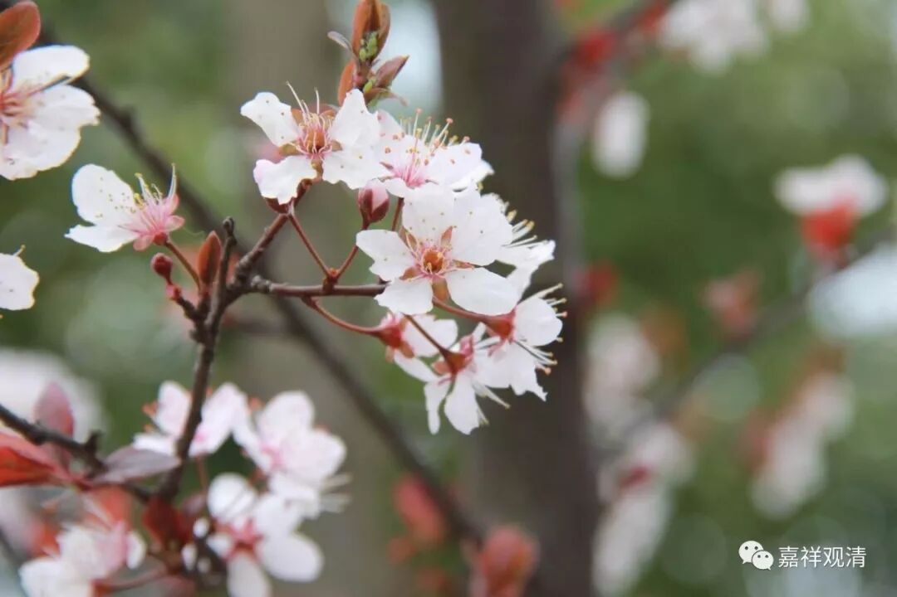

**《菩提速道》034（中）**

作为文献的由文字本身所写成的上师瑜伽、上师相应法，按照格鲁派的说法就是上师瑜伽和兜率百尊的上师瑜伽这两个，其中兜率百尊的上师瑜伽又分三类等等——这是作为文献名字的上师瑜伽。如果从修行的角度来讲，是可以把每一个密法都当作上师瑜伽，我估计可能甚至可以把显宗的修法当作上师瑜伽。

比如说，禅宗里面还有一个故事，提到这样一句诗——“频呼小玉原无事，只要檀郎认得声。”（小姐在叫丫鬟“小玉啊～”，其实是想让情郎知道：“我在这儿呢！”）师父在那里在给别人讲课的时候，其实是盯着你呢。就像释迦牟尼佛在给长爪梵志讲课的时候，后面的舍利弗先开悟了，成罗汉了。

我们大概可以这样理解：一种上师瑜伽是作为文献本身的名字，在格鲁派系统当中主要是两个，还有一种上师瑜伽是把所有的修法都当作上师的加行法来修行。上师瑜伽是一个名词嘛，就是上师相应法，就像刚才所讲的都看作是师父。我们中国人可能没有用上师瑜伽这个词，但是就认为都是善知识，都是老师，都可以从他身上学到东西。古语云：“三人行，必有我师焉。”如果翻译成西藏的话，应该就是：“每个人的身体里面都住着我的上师。”对吧？这翻译多好啊！

** “谛洛巴曾对那若巴说：”**谛洛巴是那若巴的师父。印度的历史是没法看的，谛洛巴和那若巴的故事有好几个版本，有些版本是说谛洛巴在那里吃鱼，有些版本说谛洛巴吃的是鱼的内脏。如果被日本人翻译出来，可能就是在吃生鱼片了。** “谛洛巴曾对那若巴说：‘产生功效最胜者，惟上师乎！瑜伽士！’”**对修行最重要的是什么呢？是上师！“惟上师乎！”

其实练武的事情也是一样。我以前没有觉得，现在看到别人的情况就发现越来越明显，你不要以为你跟着什么名师学习，报了多少钱的班，我真正看到的是你真的没学到东西。缺什么呢？师父真正的指点。你有那个天赋，愿意学，再遇到愿意教你的好师父，嗯，能成！

