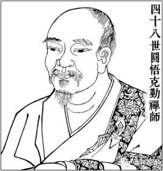
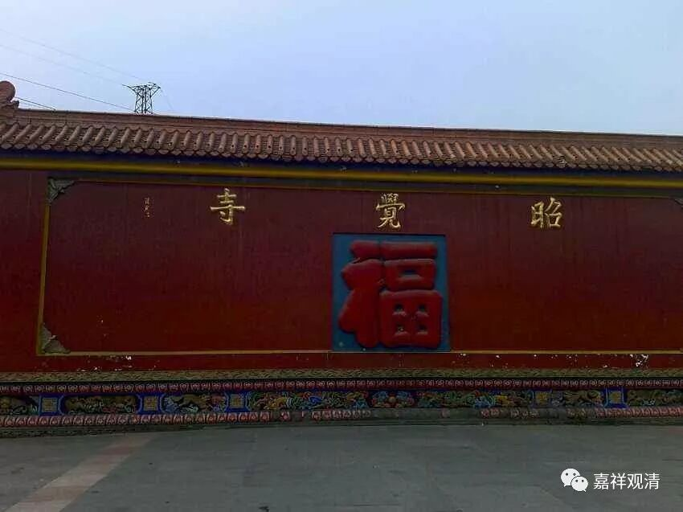
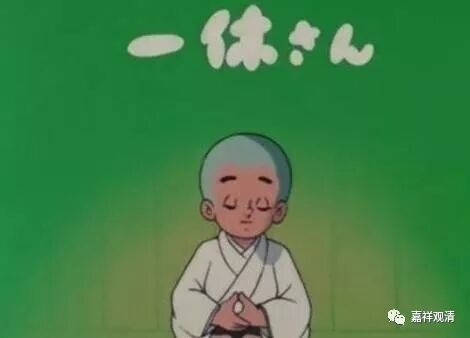

**闻小艳诗而得悟的圆悟克勤大师**

圆悟克勤禅师原来是个四川的读书人，后来出家学教。

有一次大病一场，觉得学来的东西都用不上，于是转学禅宗。他往来于诸大丛林。因为文化水平不错，能说会道，诸山长老颇为看重。

来到五祖法演门下，屡次呈上过自己的“悟境”，却都未得允可。一次，五祖法眼再次否定他，说：“你说的这些跟生死有关吗？以后到生死关头，你就知道都错用心了！”圆悟克勤禅师并不接受，下山投奔金山寺去了……

数年以后，圆悟克勤大病一场，乃知生死关头全无解脱门径。病愈后，转赴五祖法演禅师处任侍者。

一次，某官员退休来问道，举“什么是祖师西来意？”五祖法演禅师回答道：有一句诗您听说过吗？“频呼小玉原无事，只要檀郎认得声”。官员自以为听懂，满意地下山了，圆悟克勤禅师却疑情大起……五祖法演说：难道“祖师西来意”，必须要对“庭前柏树子”吗？圆悟克勤大悟！

后来，圆悟克勤驻锡四川成都昭觉寺，日本一休宗纯禅师也向他问禅。

圆悟克勤大师悟个什么？别问我，我也不知道。也许通达了诸佛“密意”不在文字，而其经教全因修心而有活力（？）。

