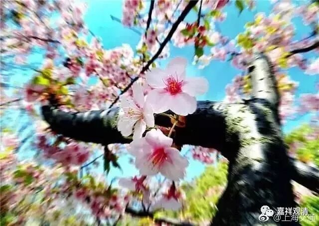
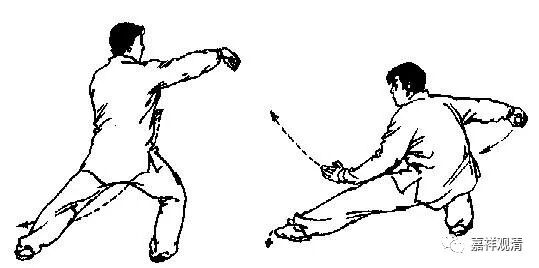
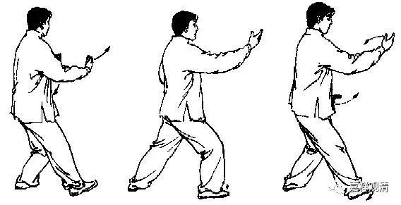
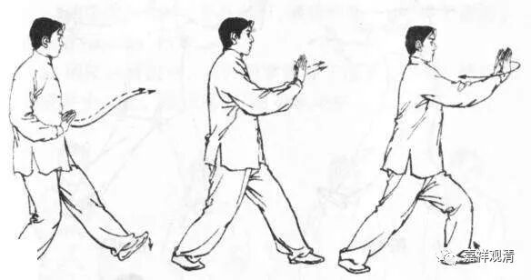
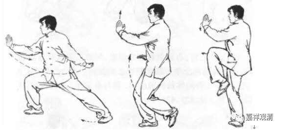

**《菩提速道》034（下）**

有一次我在机场，航班晚点二个小时，就找了个没人的角落念经。结果跑过来一个人，在那里开始拉筋了——很有趣哦，可能现在大家对锻炼都很有激情。然后又来一个老头，也在那里拉筋了，后来两个人都在那里打起了太极拳。那个老头打的太极拳，我还能看得出来有点像陈氏。另外一个人的拳就看不懂了，杨氏也不像，陈氏也不像，难道是郝式吗？难道是赵堡太极吗？

等他们打完拳以后，我就和他们聊聊天。他们俩都算是跟着师父练拳的，但我看出来的情况就是，实际上两个人都没有得到窍诀，或者说没有得到一些真正的指导。不见得他们的师父就没有教，而是他们一开始就都是以学生的方式在学习，而不是以弟子或者徒弟的方式在学习。报个班，每个礼拜几节课，那你跟师父就不是天天在一起，你就不能跟他切磋、琢磨。这种小地方，比如说这个手推出去的姿势就是不对，我一点没看出来他是在打陈氏太极拳，他的感觉是完全不对的，这些细节方面可能要全部重新磨过一遍才行。

我后来还遇到过一个，她曾经还拿过太极拳某比赛第四名，说要跟我学太极拳。我一开始都没好意思教，后来一看她打拳，呃，那真的是哪儿哪儿都是问题。她就是一个月五块钱在公园操场上学的拳，这都是没有遇到好的师父，也不会学拳。后来要纠正她的动作真是无比麻烦（后来我让她平时练拳别穿太极服、练功服，那松松垮垮的，把细节的部分都掩盖住了）。

我就想起我们以前学太极拳的时候，从某种角度上来说，我算是是我们那个班里学得比较好的一个（当然还不是最好的那个，毕竟我不是他真正入室的弟子）。很明显的一点就是，我比其他那些同学打得要好得多，因为我和程老师（五届的太极拳冠军）在一起的时间很长，至少每天就要一起站桩半个小时，一些小地方、细节他就愿意过来教你。哪怕是太极推手，或者易筋经的一些小地方，他都会提醒你，看到你练得好，他就会来指点一下，和你推个手、聊聊武林掌故什么的……这样一点点的积累，自己当时可能根本没感觉，但是后来在看别人打拳，或者在教别人打拳的时候，就非常明显，一眼就能看出什么地方不对。我觉得这就是学生和弟子的区别。

那么老师和师父的区别也是如此。如果有一个师父在身边，你一直跟着他切磋、琢磨的话，进步肯定很快。当然，你本身得确实得是有根器的，要不然师父也不愿意说。比如说基础实在太差了，或者协调性太差了，那师父也不愿意教……学佛也是一样。我发现现在有些人是以学生的心态、方式来学佛的，到点来上课，下课收拾收拾回家，和老师很少交流……其实和老师平时的互动很重要，至少也会多些互相了解、互相“键入”的时间。

拿道次第来讲，一开始是你挑师父嘛，当然要是顶尖的，谁都想要找好师父。但是肯定师父也要挑徒弟的，你水平不够的话，师父怎么教你也教不出来的。点化不透，怎么办呢？那就把一批大众一起带出来算了，而他真正愿意带的顶尖弟子肯定是不多的。你看形意拳好了，总教头李存义大师建立的国术馆，带出了很多人。其实大师看有些人也是不满意的，那就随便教完就算了。但是最后有两个人冒尖了，就是很死命地练，练到最后功夫上身了，他再刻意多指点一下……这类似于他的嫡传大弟子了。

