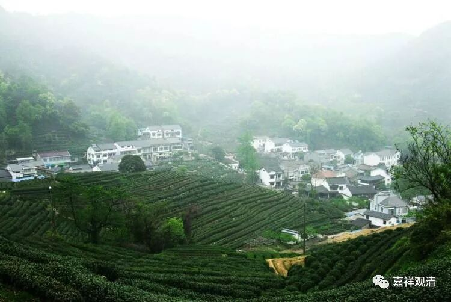
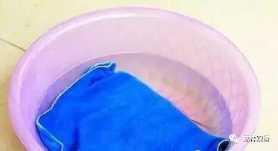

**沩山灵佑禅师**

**
**

** 见超鹫子**

沩山灵佑禅师（和弟子仰山慧寂禅师）下面开出禅宗五家七宗之一的的沩仰宗。

有一天早上，仰山慧寂禅师来问安。

沩山灵佑禅师说：“刚才我做了个梦，正好你来了，来，帮我圆一下看看？”

徒弟出去打了盆水，给师父洗脸……

过了会儿，香严智闲禅师也来给师父问安。老禅师又说：“刚才做了个梦，你师兄给我圆了。正好你到，你也给我解解梦看……”

香严禅师出去泡了碗茶，给师父端过来……

后来，老法师对外说：我这两个徒弟啊，真是比舍利弗（鹫子）还聪明啊！

清案：

这则公案，被各位禅学大佬说的玄之又玄，哈哈，禅宗是那么神秘的吗？

其实很简单，老师父在考验两个弟子——“我做了个梦，你来帮我圆个梦！”一般的弟子啊，两种反应：一、【八卦心顿起】“师父你说说看……”二、【得意地】“师父我正好学过弗洛伊德荣格阿德勒周公解梦，我来帮您解梦……”估计得到的会是一顿爆揍吧（哈哈哈哈）。

两位大禅师则不同，仰山慧寂禅师打来盆水，意思是——圆梦？师父你还没睡醒吧，来，洗把脸，清醒一下……

香严智闲禅师端来碗茶，意思也是一样——师父，来碗茶，提提神，别说梦话了。

