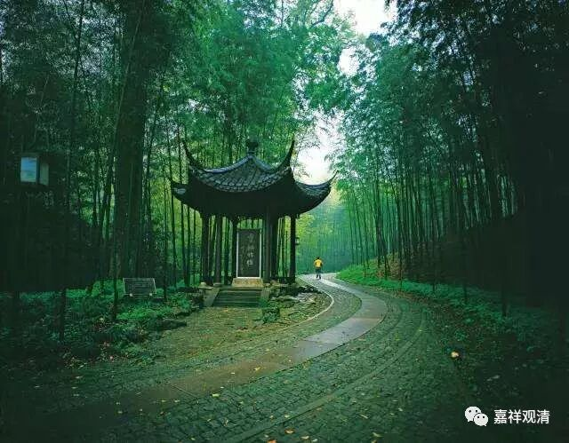
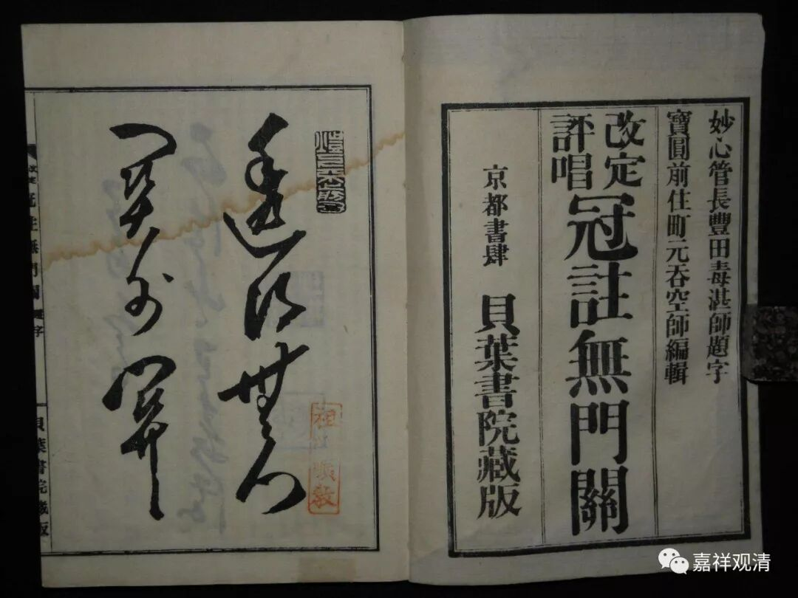
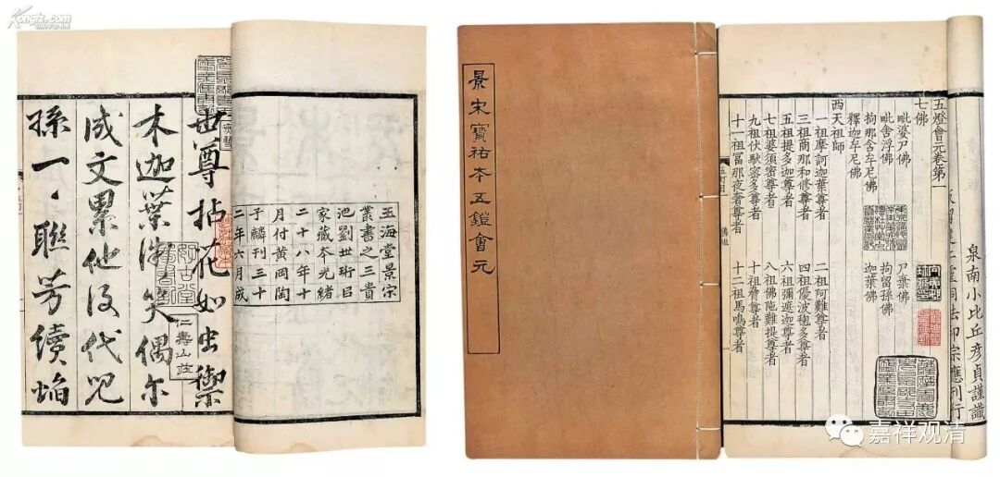

**香严智闲禅师**

** 香严上树**

香严智闲禅师出自沩山灵佑禅师门下。

无门慧开禅师的《无门关》里有一则公案提到香严智闲禅师。

“香严和尚云：如人上树，口衔树枝，手不攀枝，脚不踏树，树下有人问西来意。不对即违他所问，若对又丧身失命，正恁么时，作么生对。”

禅师说：就像人在树上，口衔着树枝，手没攀着，脚没踩上……这个时候，树下有人问“达摩大师来汉地传的是什么秘诀啊？”（如何是祖师西来意？）如果不回答吧，辜负了人家提问；回答吧，小命不保。这时候，该怎么做呢？

清案：

禅宗的故事，或者说公案，大概类似《庄子》寓言，很多并非实际发生，是虚拟一个场景，借来谈谈各自的知见。有些人认作历史的真实，大可不必。比如“香严上树”，没有人会叼着树枝挂在半空还准备做师父，是吧。“南泉斩猫”也是一样，是一个场景，不需要是真事儿。那些吵来吵去讨论南泉普愿禅师犯没犯戒的两方，都是没领会这个道理……

无门慧开禅师喜欢把公案故事截断变成新的题材，“赵州无”和“香严上树”这两则都是。这方面看来，无门慧开禅师像极了精于剪辑的导演……

剪掉的后面一半在《五灯会元》里是这样的……

“时有虎头招上座出众云：‘树上即不问，未上树时请和尚道。’师乃呵呵大笑。”

寺院的上座虎头招站出来提问：“在树上咱先不谈，没上树的时候，大师说说看？”香严禅师大笑。

很多禅盲强作解人，说“上树”是明心见性了，“未上树”的是凡夫；这是请大师为凡夫留几句话——呵呵，“牛头不对马嘴禅”大概就是这个样子了，今天很多。

招上座的意思和我一样，他的意思是：上述那个绝境咱不提，正常情况下，您谈谈……

如果是我，大概会说：那您就把脚踩实了、手抓住了，说一句看看？

