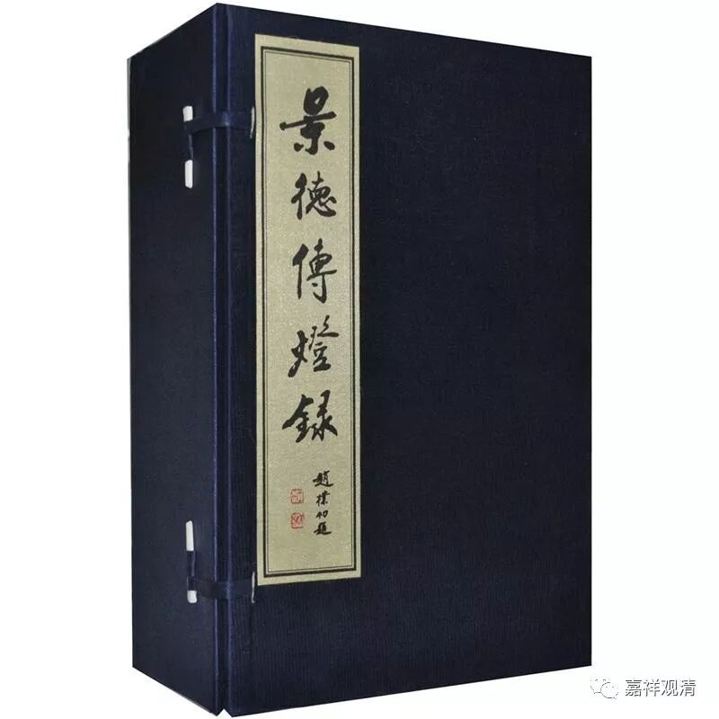

**报慈从瑰禅师**

**
**

** 成功，在坚持以后**

报慈从瑰禅师，住杭州超山报慈寺。

有僧人问：“古人说：‘今人看古教，未免心中闹。欲免心中闹，应须看古教。’请问什么是‘古教’？”

禅师回答：“如是我闻——‘古教’就是指的那些经论嘛！”

又问：“那什么是‘心中闹’呢？”

禅师回答：“那边鸟儿在叫——分心啦！”

** 《景德传灯录》卷二十一：**

** 杭州报慈院从瑰禅师福州人也。姓陈氏。……**

** 僧问：古人有言：今人看古教，未免心中闹。欲免心中闹，应须看古教。如何是古教？**

** 师曰：如是我闻。**

** 僧曰：如何是心中闹。**

** 师曰：那畔雀儿声。**

清案：

今人看古教，未免心中闹。

欲免心中闹，应须看古教。

这是说，读经学习，心有散乱，但你要断除这些障碍，还是得安心学习。这个公案不难理解，没有玄之又玄的浪漫。

这个颂子还出现过几次。

有一次，法眼文益禅师看见有和尚在读经，就说“今人看古教，不免心中闹；欲免心中闹，但知看古教。”他问读经的僧人：“明白吗？”回答说：“没明白。”禅师说：“当面问你明不明白。你现在这么看着我，是真的不明白啊！”（以前的僧人文化低，今天我们认为很简单的东西，他们不一定反应得过来。）

** 法眼文益禅师**

** 因僧看经**

** “今人看古教，不免心中闹。欲免心中闹，但知看古教。”**

** 问僧云：“会么？”**

** 对：“不会。”**

** “会与不会，与汝面对。若也面对，真个不会。”**

了堂唯一禅师也有过自己的评论，他说：“什么是‘看古教，心中闹’呢？唉，就像经书里说‘阿耨达池深广四十丈’，这也要写下来让大家知道——无效知识嘛！”（可是，他说的对吗？）

** 了堂唯一禅师**

** 看藏经上堂：“‘今人看古教，未免心中闹。欲免心中闹，须知看古教。’古德与么说话‘也有权也有实’也有照也有用。未免有一处誵讹。”良久：“阿耨达池深四十丈，阔四十丈，也要诸人共知。”**

