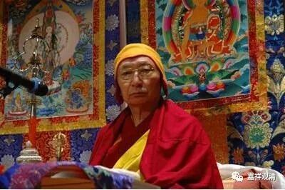
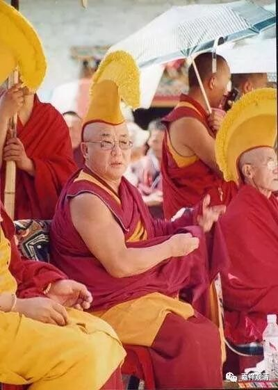
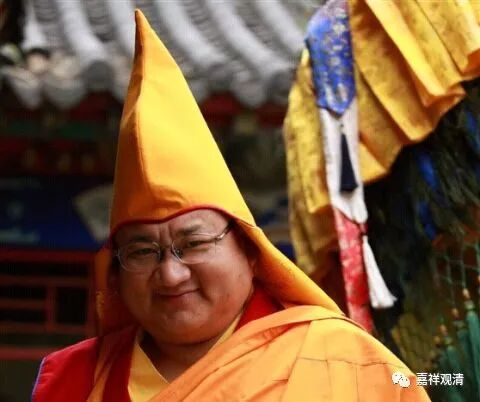

**《菩提速道》036（中）**

** “上托钵盂，甘露盈满，披著褐黄色法衣，顶戴金黄色的班智达帽，相好庄严，以澄净的光明为体，”**再过几十年，我们汉地是不是要戴太虚帽了？就是一般的那种，和伊斯兰教的帽子差不多，只不过伊斯兰教是白颜色的，我们是咖啡颜色的。而西藏是戴班智达帽等等（他们帽子种类很多）。

现在也有很多冒充西藏活佛的，不懂规矩，帽子乱戴，甚至戴的帽子都有白无常的帽子。他不懂嘛，没见过实物，就搞个白无常的帽子戴着，真是特别有趣，一看他们出来，知道的那是骗子“传法”，不知道的还以为两排鬼出来了。（没找到照片。）

** “金刚跏趺，安坐于自身所发的光蕴之中，”**全都是光，“光蕴”，就是光的聚集。“** 心间有释迦牟尼佛，”**上师善慧能仁金刚持，这里心间的释迦牟尼佛就是能仁** 。“释迦佛的心中是金刚持佛。”**“金刚持佛”，这里有个个概念，就是法身佛的概念。如果在汉地的话，法身佛的意思肯定不是用金刚持佛，而是用毗卢遮那佛，是吧？

** “上师右边的莲瓣上，是大威德金刚诸天众等，左边的莲瓣上是胜乐金刚诸天众，前面的莲瓣上是密集金刚诸天众，后面的莲瓣上是欢喜金刚诸天众等环绕。”**这里的“诸天众”的“天”，都应该理解为“第一义天”，就是佛（菩萨）们。

** **

** “其下一层的莲瓣上有时轮金刚、黑阎摩敌、红阎摩敌等无上瑜伽部的诸天众围绕安住。**

** 再下一层为普明大日如来等瑜伽部的诸天众围绕。**

** 其次为毗卢遮那现证佛等行部诸天众围绕安住。**

** 其次为能仁誓言三尊等事部诸天众围绕安住。**

** 其次有贤劫千佛、三十五佛等围绕安住。”**一般就是观想三十五佛加上药师八佛……贤劫千佛就太多了。

** “其次有八大菩萨等诸菩萨众围绕安住。**

** 其次为十二缘觉等围绕。”**这个“十二缘觉”的出处在哪里？有人去查过吗？我怎么从来没有见过呢？这个恐怕又是密宗的法里面提到的。

** “其次为十六罗汉等诸大声闻围绕安住。**

** 其次为勇士空行圣众围绕安住。**

** 最下为诸护法众围绕安住。”**

