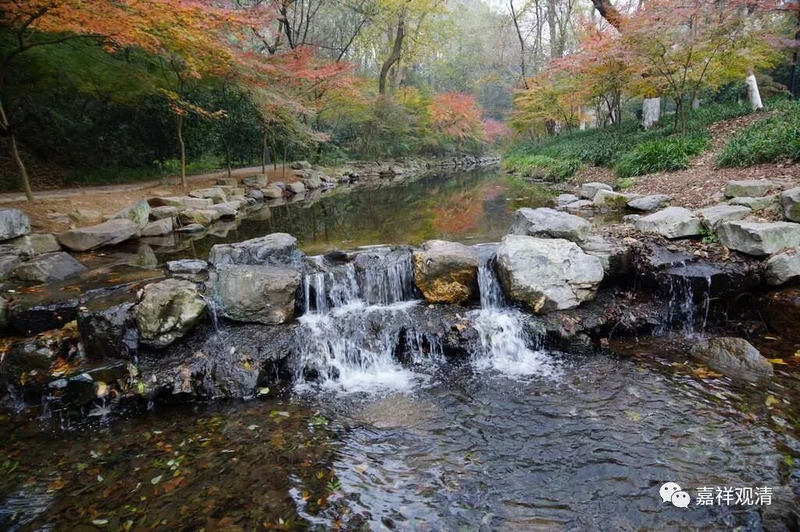
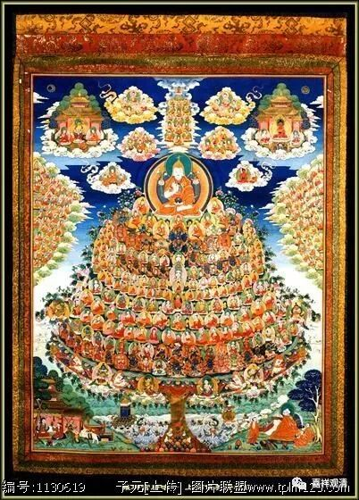

**《菩提速道》036（下）**

我们现在所常见的上师供资粮田，是有点类似平面的一棵树，是横排的。如果大家有空的话，可以去北京的雍和宫看看，雍和宫里面有一个小型的博物馆，在最中间坐着的是喇嘛形象的乾隆皇帝。在那个博物馆里面有很多的文物，其中有一件文物给我留下了很深的印象，就是“上师供资粮田”。

那个上师供资粮田画得非常好，是立体的，当然它不是今天的3D啊，就是画成有立体感的，看起来佛菩萨排列一层一层的，就像蛋糕一样，就等于一个十三层蛋糕。然后这些勇士、空行、护法、佛陀等等，是这样一层一层地排在最外面的，在这两层之间不是有一圈吗？这一圈排的都是佛，这样一圈一圈地上去。我们现在的资粮田都好像被拉平了的世界地图，我们应该要把它想象成蛋糕的样子，不理解的话，可以去买个蛋糕来看看。

雍和宫上师供资粮田

** “外围有寻香众围绕着持国天王，瓶腹夜叉围绕着增长天王，诸龙众围绕着广目天王，夜叉众围绕着多闻天王，威严地安住于四方，守护遮止自己的障难。”**前面已经讲过了，这四大天王是帮助我们的——“东方持国南增长，西方广目北多闻”。四大天王所管辖的是谁呢？管的是寻香众、乾达婆、药叉、龙等等，对吧？他们是我们的护法，帮助我们遮止障碍。

** “上师能仁心间向上方放出与上师数相等的光芒，”**中间是上师，表现为宗喀巴大师的样子，在他的心间是释迦牟尼佛的样子，这就叫上师善慧能仁金刚持，简称“上师能仁”。

** “光端杂色莲花日月垫上，安住着胜者金刚持，修行加持派的传承上师谛洛巴、那若巴、吉祥最胜仲比巴等围绕安住。向右方放光，光端杂色莲花月轮垫上，无著菩萨等广行派的传承上师围绕着至尊弥勒安然而住。向左方放光，光端杂色莲花月轮垫上，龙树菩萨等深见派的传承上师围绕着至尊文殊安然而住。在前方，与自己有直接法缘的诸位上师围绕着自己的根本上师安然而住。诸尊的面前各有一张庄严圆满的供桌，其上供有各自所说的教法，呈现为光明的经函相。资粮田外围，随应化机幻变出不可思议的种种景象散向十方。”**

** **

就是说，观想佛菩萨们不是一个固定的形象，不是像刻板的雕像一样，还有在变化，在做各种事业，就好像动画片一样，可能更像今天的电脑游戏……所以有人建议，“这些观想内容，能不能做成动画片？”老一辈的不太接受这一建议，但现在也有人做的。好像金刚萨陀忏罪的就有做成动画的。

