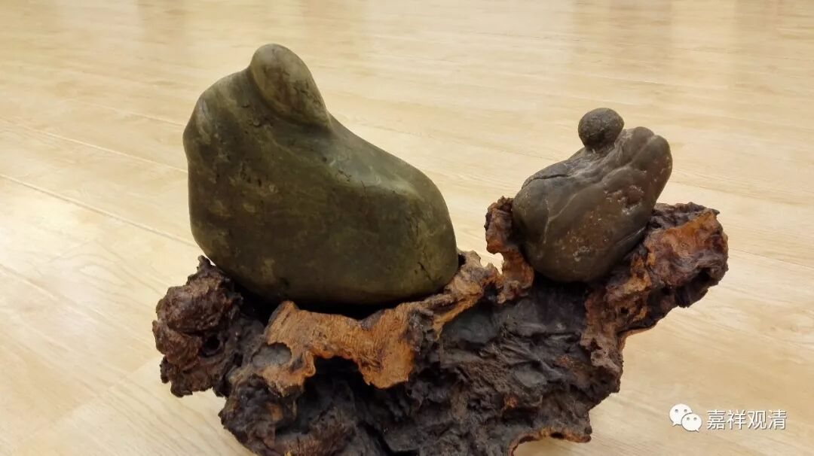

**庐山延庆叔禅师**

** “一回相见一回老，能得几时为弟兄”**

** 《续传灯录》卷三十：**

** 庐山延庆叔禅师**

** 僧问：“多子塔前，共谈何事？”**

** 师曰：“一回相见一回老，能得几时为弟兄？”**

** 僧礼拜。**

** 师曰：“唐兴今日失利。”**

这则公案里有很多典故，如果不说清楚的话，我们完全不明白双方在说什么，可能也因此对禅宗、对禅师增加了很多“神秘”感。其实都是师父教徒弟，没那么神神秘秘的，只是当时惯用的典故，我们不熟悉罢了。在我看来，禅宗可是很活泼的。

一个一个来。

1、“多子塔”，梵名Bahuputraka -caitya ，巴利名Bahuputtaka-cetiya, Bahuputta-cetiya 。又作千子塔，位于中印度毗舍离城西。禅宗传说，释迦佛在这里“拈花一笑”，附嘱迦叶“教外别传”之禅宗。

2、“多子塔前，共谈何事？”就是问“释迦佛和迦叶谈什么了？（拈花一笑，附嘱迦叶什么了？）”

另外，“多子塔前，共谈何事？”也是一则公案，《空谷集》云：

“有僧问兴化存奘：‘多子塔前，共谈何事？’

化云：‘一人作虚，万人传实。’”

有人问兴化存奘禅师：“多子塔前面，释迦佛和迦叶说啥了？”

兴化存奘禅师回答：“一人作虚，万人传实。——一个人随便做点啥，大家还当真了。（也可以理解为：最初只是泛泛的言说，慢慢演化出禅门来了。）”

3、“一回相见一回老，能得几时为弟兄？”

这原本是宋·法昭禅师的一首诗颂是说兄弟相处的：

** “同气连枝各自荣，些些言语莫伤情；**

** 一回相见一回老，能得几时为弟兄。**

** 弟兄同居忍便安，莫因毫末起争端；**

** 眼前生子又兄弟，留与儿孙作样看。”**

延庆叔禅师借用这句“一回相见一回老，能得几时为弟兄”，不是用的原来诗句的意思。这里的意思是，两个老人在唠嗑呢：“我们见一回老一回啦，再碰到可不容易咯……”

4、唐兴：“唐”，白白地；“兴”，做。这个比较简单，意思是白白地磕头了——意思是：小和尚，你领会错意思了吧？不要白白磕头（答谢）哦！

串起来，就是

有僧人举“多子塔前，共谈何事”的公案问延庆叔禅师。

禅师回答：释迦佛和迦叶在那儿说的是啊：“你我都年纪大咯，见一回老一回咯……”——他们在聊家常呢。

僧人磕头。

禅师说：“嘿嘿，你这个头不要磕错了呦！（我只是跟大家开个玩笑嘛……）”（清案：如果只会照原先的答案背一句“一人作虚，万人传实”多无聊嘛！）

有没有禅师很可爱：）

