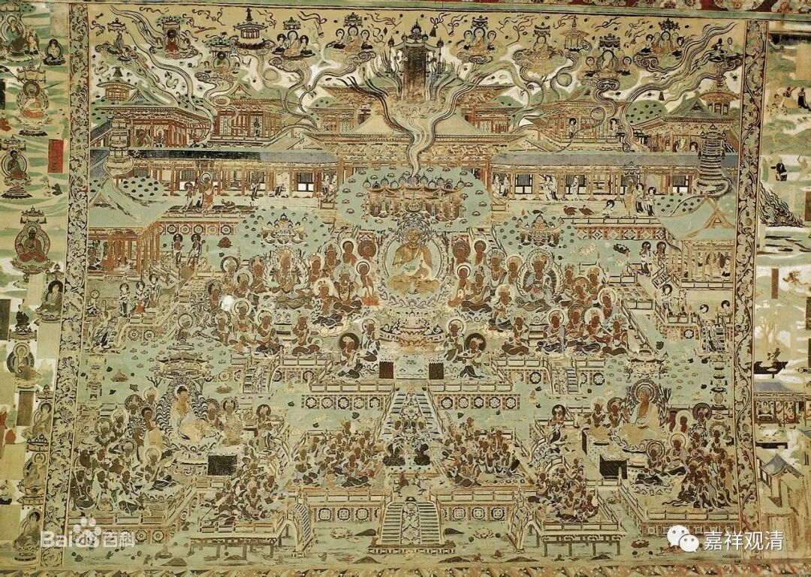

**仰山慧寂禅师**

** 三座说法**

无门慧开禅师作《无门关》，有四十八则公案的评唱，今天聊聊地二十五则《三座说法》。

《无门关》无门慧开禅师

** 二十五·三座说法 **

** **

** 仰山和尚，梦见往弥勒所，安第三座。**

** 有一尊者，白槌云：“今日当第三座说法。”**

** 山乃起白槌云：“摩诃衍法，离四句，绝百非。谛听！谛听！”**

仰山慧寂禅师是沩山灵佑禅师弟子（法嗣），下开沩仰宗，宗风为“父子唱和”。

有一次，仰山慧寂禅师梦到自己来到了都帅内院，在弥勒菩萨下面坐第三座。（《五灯会元》说是“第二座”。大概两本书总有一个抄错或者印错了。）

有位尊者鸣槌召集大众，说：“今天第三座大师讲法！”

仰山慧寂禅师于是说：“大乘之法，离四句，绝百非！谛听！谛听！”

《五灯会元》接着说。大家散去。仰山禅师醒来以后跟师父汇报了。沩山灵佑禅师说：“你已经登入圣位了。”

这则公案也很明白，不多讲了。但有个常见的典故需要补充说一下——“离四句、绝百非”。

“四句”，就是“一、异、有、无”这四句。离四句。就是非一、非异、非有、非无。

“绝百非”：上之四句各自有四，即十六；十六而有过去、现在、未来三世，即四十八；此上又有已生和未生，得九十六；加上原来的四句，就是一百。绝百非，其实就是此等皆“（自性）无”！（“百非”也可以理解为是一个约数，百。就是很多的意思。上说为具体的经教当中的算法。）

