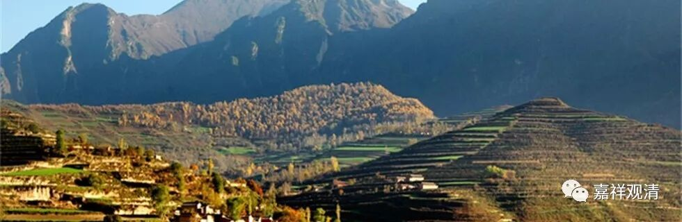

**《菩提速道》027（下）**

如果要修得复杂一点的话，就有一大堆的东西要观想了，是吧？“杂吽榜火”，放出来的光是什么样子，他们在放些什么光，那一面的光又是什么样子……然后拉过来，融入啊，又“勾入”啊，“缚喜”啊等等——这就是更复杂的。其实一开始不需要这么复杂，你可以先单独修，单独修了以后，就很快能观想起来。对我们来说，暂时不需要“勾入缚喜”，也没有问题的，就想像融入也可以了。

我也不好怎么说，就是觉得很有趣，勾入缚喜这些内容虽然说是一些技巧，但是这些技巧好像很没有技术含量。也就是，放出的光，前面带个钩，再带个圈圈，勾住再拉过来等等，好像不怎么带技术含量。和前面的道次第的内容相比，和中观唯识的高技术含量相比，差别太大了。所以大家都觉得：“密宗更好修嘛。显宗太难了，那我就学密宗吧！”很多人都这么想喽。那是因为他们没有接触过密宗的理论，是吧？密宗的那些理论，我真的没学过，我也就不说了。

“悯众修大悲”，就是念颂文，然后按照这个来观想。

** “戊五、观起浴室，”**就是请他们洗澡。** “向诸尊供献沐浴等后，供献七支供及曼扎，此中摄尽了一切积资忏净的扼要之处。”**我估计西藏人一开始接触这个洗澡的时候是要崩溃的，因为西藏人是没有类似的洗澡概念的。印度那么热，印度人才有每天洗澡的概念，是吧？早先西藏人看到这个洗澡，肯定是想破头都想不出来：“干吗要洗那么多澡？”

西藏人还不至于一辈子不洗澡，他们那里又不是沙漠，是有水的。洗澡少，其实是因为懒嘛，在那里比较干燥的，你如果出汗的话，马上就干了。我们夏天要洗澡，是因为身上粘粘乎乎的难受，就赶快去洗一个。但是人家西藏人不粘啊，像某位师父做铁棒喇嘛的那一年，他没机会到外面去洗澡，那个时候家里面又没有洗澡的条件，那是真粘啊！每过一两个月，他就拿个盆儿，往里倒一点热水，在那里搓。就像济公和尚一样，一搓就是一把，直接嘎巴嘎巴地往下掉了，于是地上出来很多“肥料”。他结束任务，把铁棒喇嘛交割后的第二天我就带他去洗澡，我说：“你一年没洗了，我带你洗澡，我请客。”结果我就挺奇怪的，他洗得还比我快。他们不洗澡，好像也不觉得身上有味道，而我就是“久入鲍鱼之肆”，对吧？

那个时候进出都是坐长途车的，长途车上的那个味道实在是太重了。如果你边上恰好挤着一个刚从草原上出来去兰州看病的人，哦——那个味道太重了！实际上我自己比他也好不了多少。那段时间经常有人问我洗澡的问题，因为对上海人来说，他们觉得很重要的一点就是洗澡。其实那个时候，开头几年还没那么多地方洗澡，后来就开始一家一家的澡堂都开出来了。当时别人问我怎么洗澡的，我说“想得起来的话，大概半个月洗一次”。我觉得这已经很好了，他们却惊叹：“啊？居然那么长时间！”我当时觉得，能够半个月洗一次已经很不错了。

我曾经带一个小喇嘛去洗澡，去到一家新开的店，还是太阳能的。我把他带进去以后，就到隔壁间去洗了。他没洗过澡，都不知道怎么用淋浴洗澡，进去之后，就把水龙头打开，把头发淋一淋，就跑掉了。我对金巴师父说：“我还给他付了洗澡的钱，他居然只把脑袋淋了一淋就走了。”金巴师父说：“没办法，太丢人了，他们不会洗澡。”

后来的情况就好多了。看来民族团结真是非常重要的，因为很多澡堂子都是穆斯林开的，他们爱干净嘛。一开始的澡堂是用太阳能的，但你知道那个热水肯定是不多的。再过了几年呢，就有了烧煤的锅炉。啊！那个洗起来是太舒服了，才花了五六块钱，洗起来太爽了，半个月可以爽一次。特别爽的是，搓出泥的时候，超有成就感。

