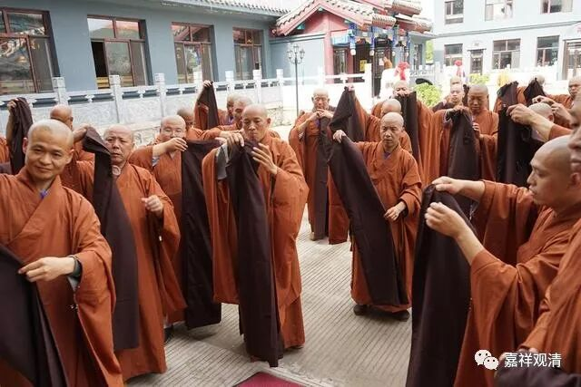

**云门文偃禅师**

** 披上袈裟有事忙**

《无门关》十六·钟声七条

** 云门曰：“世界凭么广阔，因甚么向钟声里披七条？”**

云门文偃禅师，嘉兴人，师从禅将雪峰义存禅师，下开五家七宗之云门宗，门下得法弟子众多，故禅门里有“云门天子”之说。

有一次上堂开示前，正逢寺院里钟声响起。云门禅师借着这个由头便说：“世界这么大，为什么在这钟声里披上这袈裟呢？”——意思是，“世上有这么多的事情可做，你们为什么跑到庙里来出家呢？”言外之意则是：“你们这些出了家的好好想想，要对得起自己（出家）的发心，对得起这身袈裟！别空过了这一生！”

“钟声”不谈了，都知道指寺院里的钟鼓声。

** 僧人们手里的就是七条衣、郁多罗僧**

“七条”，指出家人必备“三衣”中的“七条衣”，梵名郁多罗僧，即上衣，由七块布缝制而成，故又称“七条”。后来在汉地寺院里，一般在正式场合会穿，已经渐渐礼服化了。它也是袈裟的一种。“披七条”，指穿袈裟，意指出家。

是啊，出家人应该想的不是“世界那么大，我想去看看……”，而是“已经进了佛门，要对得起自己的初心，对得起身上这件袈裟，要努力成办解脱之大事！”

“因甚么向钟声里披七条？”不能理解为“世界那么大，我想去看看！咦！我咋还穿着袈裟呢？脱了吧！”著袈裟是激励趣向解脱，而不是说因为七条有碍自己轮回（里的享受）而一脱为快！有些还俗的还不要脸地说什么“勇于直面”——呵呵，纵容自己的烦恼，有啥可骄傲的！

