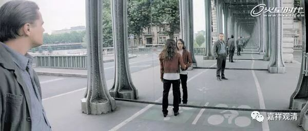

**《菩提速道》讲记038（上）**

还在拉卜楞寺建立的时候，嘉木样活佛专门邀请了六户汉人和六户穆斯林来居住，为什么呢？因为这两个民族比较会做生意。结果汉人的繁殖速率要远远低于穆斯林的繁殖速率，现在穆斯林的人数已经很多了，汉人还是没多少。不过，你可以看出，一世嘉木样活佛和二世嘉木样活佛的思路非常清晰——有了这六户加六户的十二户人家以后，当地慢慢地发展为集镇了，经济起来了。

我们刚才讲到浴室，是吗？结果从浴室就聊出去那么多，现在回来吧。

** **

** “（一）顶礼支：**

** 观自身变化出刹土微尘数量的化身而作顶礼，”**这个“变化出”不一定是抖一抖，身上的毛飞出去变的，不一定是这样的。你就想象一下，忽然之间有无量无边的自己在磕头。向谁磕头呢？向无量无边的佛陀磕头。最简单的方式就是按照我们这个房间来设想，四面都是镜子，你在这里放一尊佛，然后往那里磕头，在镜子里看起来，就好像无穷多个我在给无穷多个佛磕头一样，对吧？我们这样，就是华严境界啊！我们给这个房间再装两面镜子，天花板和地板再装的话，直接就晕菜了。

华严宗是有这个做法的，有时候他们闭关的时候，就装上十面镜子——四面八方再加上下。在这个里面闭关，我估计醒过来的时候，可能一下子都搞不清楚哪个是自己，要反应半天：“哦，这个才是自己安立‘我’的所依。”现在知道了吧，我为什么睡觉的时候要把这两块幕布都拉上？就是怕醒过来的时候找不到自己了（两边都是镜子）。哈哈，证空了。如果我意识留在镜子里面出定怎么办？会不会出不来了（这脑洞有点大了）？

华严宗这么做的意思是华严的境界重重无尽，一个镜子里面包括了所有的镜子，而且这个镜子当中又包括了随一镜子里所有的一切。这个包括，就等于是在这面镜子当中包括了所有一切镜子当中的东西，而所有的这些镜子的每一个都包含了所有其他镜子当中的所有一切，华严的重重无尽就是这样体现的。所以华严宗就用这个作为华严境界的一种示范。你准备做一个吗？我先把你扔进去，然后看你晕的时候，把镜子一下子全部打破，你会不会就……

说不定镜子打破以后，看到那里就剩一堆衣服落下，人，没了……

