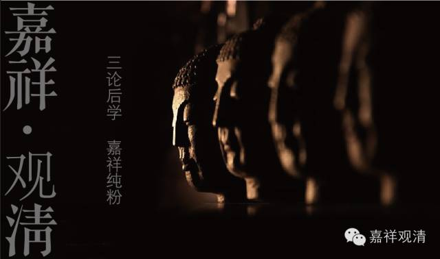
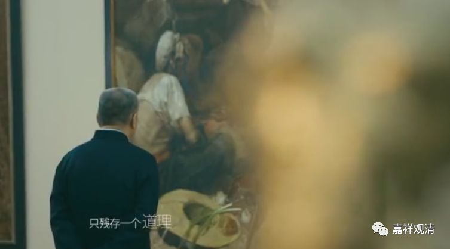

**慧可大师**

** 断臂求法**

《无门关》：

** 达磨安心**

**
**

** 达磨面壁，二祖立雪断臂云：“弟子心未安，乞师安心。”**

** 磨云：“将心来！与汝安。”**

** 祖云：“觅心了，不可得！”**

** 磨云：“为汝安心竟！”**

清案：这一则公案流行颇广，几乎无人不知，却不是历史的真实。前几期说过，和《庄子》里的寓言一样，禅门的公案很多并非事实，只是讲一个道理。观复马爷也说了——

“历史没有真相，只残存一个道理！”——真是对极了！

慧可大师师从达摩大师，此无异议，但立学明志、断臂求法则是演义了（我若是达摩大师的话，真的会害怕的：剁了个手就来了？！这位仁兄是混哪个社团的？）。更早的道宣律师的《续高僧传》里说，慧可大师的断臂是在乱世遇上了强盗被砍的。

《续高僧传》卷十六：

** （可）遭贼斫臂。以法御心，不觉痛苦，火烧斫处，血断帛裹，乞食如故，曾不告人。**

** 后林又被贼斫其臂，叫号通夕。可为治裹，乞食供林。**

** 林怪可手不便，怒之。**

** 可曰：“饼食在前，何不自裹。”**

** 林曰：“我无臂也，可不知耶？”**

** 可曰：“我亦无臂，复何可怒？”**

** 因相委问，方知有功……**

这是说，慧可大师先得达摩祖师传授《楞伽经》……后来遇到强盗被砍了胳膊。他用禅定功夫收摄心神，不觉痛苦。用火把砍伤的地方烧过（消毒），血止住以后拿布裹好，并不告诉他人。后来另一个伙伴林禅师也被砍伤了胳膊，整晚号叫……慧可大师还帮着照顾他（这是用来做对比，说明慧可大师禅修功夫是比较高的）。

相对来说，早出的《续高僧传》的记载应该更接近历史的真实吧。

抛开真相，这则公案那留下的道理是什么呢？

——** 若求“安心”，当证“心空”**（“觅心了，不可得”）！

