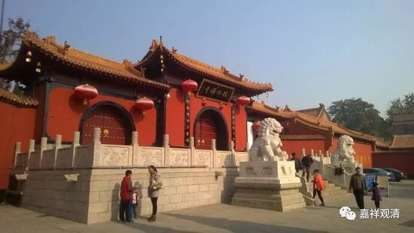
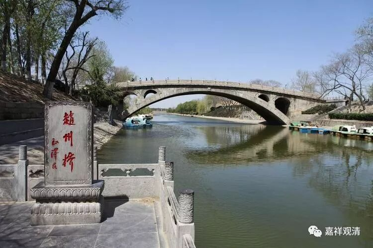

**赵州从谂禅师**

**
**

** 狗子有无佛性**

《赵州录》卷上：

** （僧）问（赵州）：“狗子还有佛性也无？”**

** 师云：“无！”**

** 学（僧）云：“上至诸佛，下至蚁子，皆有佛性。狗子为什么无？”**

** 师云：“为伊有业识性在！”**

清案：

昨天谈到，禅宗故事可以理解为“禅门寓言”，关键不在故事是否是历史的真实，而是背后的“观机逗教”，所谓“历史没有真相，只残存一个道理”。今天我们再来看一个“赵州无”的公案，这里，佛教里确定的理论（对当时佛教界而言）、有确定答案的问题都被禅师们打破了，来回来去地观机设教，引导学僧。

有僧人问赵州从谂禅师：“狗子有没有佛性？”

赵州从谂禅师回答：“没有！”

学生懵了：“上至诸佛，下至蝼蚁，一切众生都有佛性，为什么禅师说狗子没有佛性？！”

禅师回答：“因为他有业识在！（有障碍在！）”

这里，赵州禅师没有按照通常的答案说“有”，而是换个角度来说。

同样的意思，我们看石头希迁禅师的做派：

** 大朗问石头：“如何是佛？”**

** 头曰：“汝无佛性！”**

** 曰：“蠢动含灵，又作麽生？”**

** 头曰：“蠢动含灵，却有佛性。”**

** 曰：“慧朗为甚麽却无？”**

** 头曰：“为汝不肯承当！”**

** 朗於言下信入。**

** 住后，凡学者至，皆曰：“去、去，汝无佛性！”**

慧朗禅师问石头希迁禅师“什么是佛”，石头希迁禅师禅师直接说他没佛性。慧朗禅师奇怪地问“为什么其他众生都有您却说我没有？”石头希迁禅师回：“因为你不肯承当！”没有这个责任感！

禅师们的杀活手段不止于此。

再有人问赵州从谂禅师同样的问题时，他的答案又变了——

《古尊宿语录》卷十四：

** 问（赵州）：“狗子还有佛性也无？”**

** 师云：“家家门前通长安！”**

答案变成“家家门前通长安”，每户人家门前的路都通长安城——这又变成“狗子有佛性”的意思了。

还有人问同样的问题怎么办？

** 又有僧问：“狗子还有佛性也否？”**

** 师曰：“有！”**

** 僧曰：“既是佛性，为什么撞入这个皮袋里？”**

** 师曰：“为他知故犯。”**

** **

这次回答“有”！对方反应也很快，改问：“既然有佛性干嘛做了狗了？！”赵州禅师回答：“他明知故犯呗！”（呵呵，轮回中的我们也是明知故犯。）

但最常听到的是“赵州无”的半截子公案，出自无门慧开禅师的《无门关》。

问（赵州）：“狗子还有佛性也无？”

师云：“无！”

无门慧开禅师把公案截断，又是一种禅将做派！明白吗？

不明白的，翻我的老贴去……

