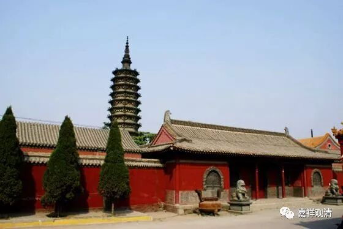
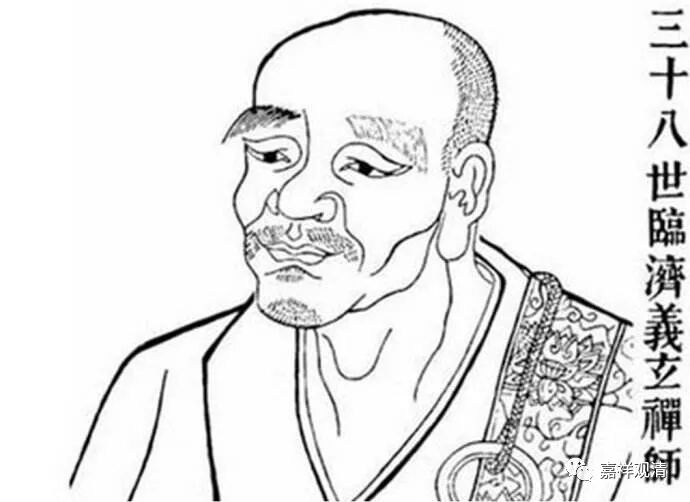
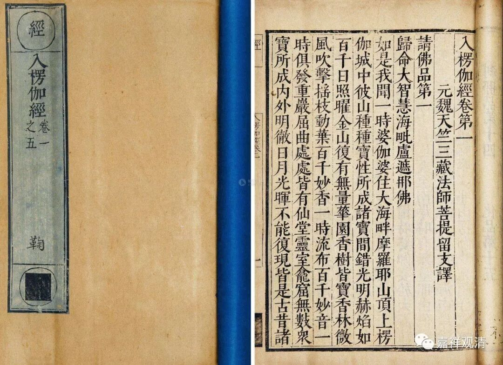
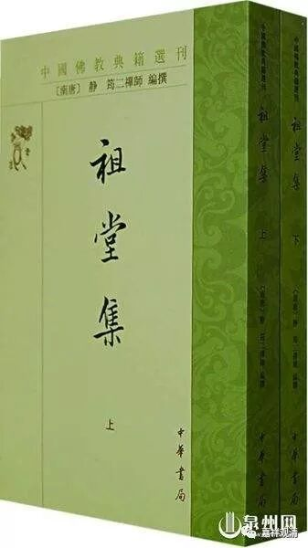

正定临济寺

**临济义玄禅师**

** 离教一字，即同魔说**

临济义玄禅师，黄檗希运禅师门下，下开临济一宗，世称“临济将军”。后世有谓“临天下、曹一角”。临济宗风俊烈，有些言论常令人下出一身冷汗。

《临济录》有云：

** “道流！你欲得如法见解，但莫受人惑。向里向外，逢着便杀，逢佛杀佛，逢祖杀祖，逢罗汉杀罗汉，逢父母杀父母，逢亲眷杀亲眷，始得解脱。不与物拘，透脱自在。”**

临济义玄禅师说：“同修道友们，你们要得如法知见，就不要被人瞒惑。但行逆罪，佛祖、罗汉、父母、亲戚，逢着便杀，就得解脱，超出世间，自在解脱！……”

看到这里，通常人除了吓出一身冷汗的，就是以为又是什么高妙的境界，其实，这都是佛典常见的通说。这里所谓“莫受人惑”、“向里向外”、“行五无间得解脱”，都是指《楞伽经》。别忘了，禅宗的前五祖都被称为“楞伽师”的（北宗以为，禅宗其实就是“楞伽师”。敦煌有《楞伽师资记》）！

唐译《楞伽经》：

** 佛告大慧：“五无间者，所谓：杀母，杀父，杀阿罗汉，破和合僧，怀恶逆心出佛身血。大慧！何者为众生母？谓引生爱与贪喜俱，如母养育。何者为父？所谓无明，令生六处聚落中故。断二根本，名杀父母。云何杀阿罗汉？谓随眠为怨如鼠毒发，究竟断彼，是故说名杀阿罗汉。云何破和合僧？谓诸蕴异相和合积聚，究竟断彼名为破僧。云何恶心出佛身血？谓八识身妄生思觉，见自心外自相共相，以三解脱无漏恶心，究竟断彼八识身佛，名为恶心出佛身血。大慧！是为内五无间，若有作者，无间即得现证实法。”**

** **

** “复次，大慧！今为汝说外五无间，令汝及余菩萨闻是义已，于未来世不生疑惑。云何外五无间？谓余教中所说无间，若有作者，于三解脱不能现证，唯除如来、诸大菩萨及大声闻，见其有造无间业者，为欲劝发令其改过，以神通力示同其事，寻即悔除证于解脱，此皆化现非是实造，若有实造无间业者，终无现身而得解脱，唯除觉了自心所现身资所住，离我我所分别执见；或于来世余处受生，遇善知识离分别过，方证解脱。”**

** **

** 尔时世尊重说颂言：**

** “贪爱名为母，无明则是父；**

** 识了于境界，此则名为佛。**

** 随眠阿罗汉，蕴聚和合僧；**

** 断彼无余间，是名无间业。”**

《楞伽经》这是说，向内：贪爱为母，无明为父，分别能所二取为佛、随眠（潜伏的烦恼）为阿罗汉，五蕴独立而和合为僧——断除贪爱、无明、随眠、二取、五蕴独立实有者则得解脱。真实做五无间业者，则定颠倒堕落。

临济义玄禅师不过是在白话讲解《楞伽经》这段而已。《杂集论》里说这叫“秘密转变”——文字的意思有转变，非如字面那样解释。

另外，临济义玄禅师本非后世以为的老实巴交的种地和尚，相反，他曾是个对《瑜伽师地论》等唯识教典颇有心得的唯识师呢。早期禅宗文献《祖堂集》卷十九说：

** “……于时，（临济义玄）师在（黄檗希运禅师）众，闻已，便往（大愚禅师处）造谒。既到其所，具陈上说。至夜间，于大愚前说《瑜珈论》，谭唯识，复申问难……”**

这是说，临济义玄参访大愚禅师第一天晚上就是聊的唯识和《瑜伽师地论》，是个读书人呢！

