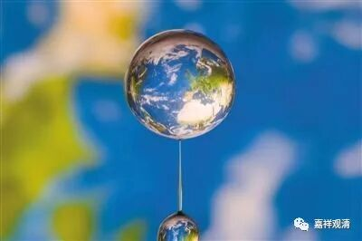
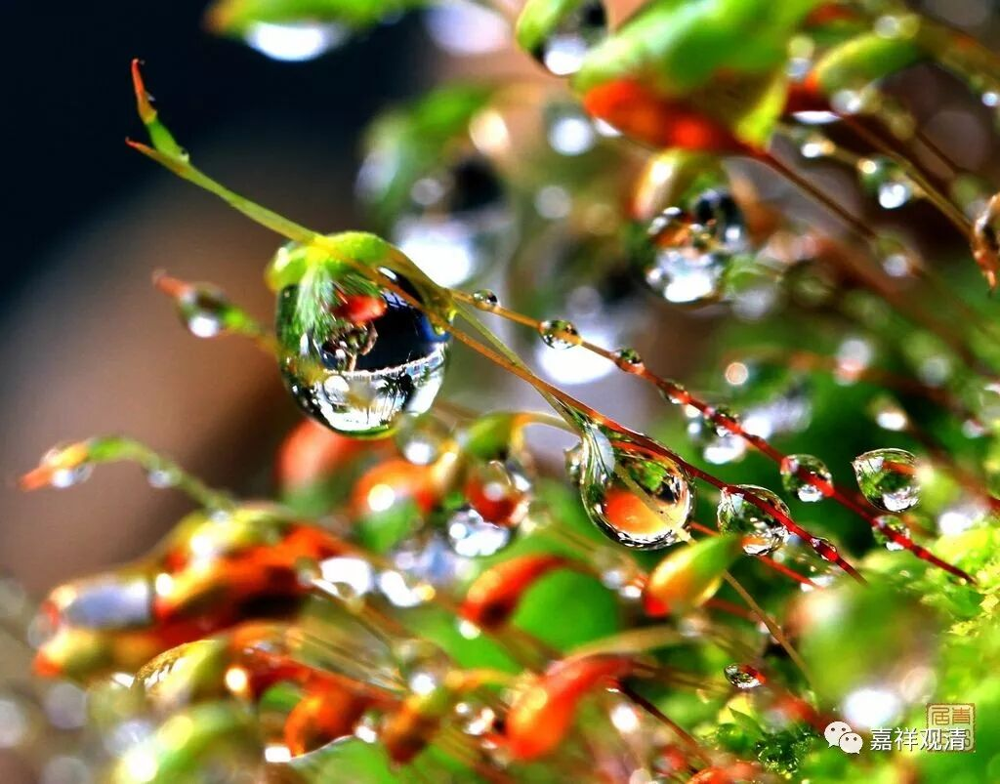

**《菩提速道》讲记039（上）**

** **

** “三门顶礼中，身顶礼者：”**这下面的内容还是《普贤行愿品》的。

** “‘普贤行愿威神力，普现一切如来前，**

** 一身复现刹尘身，一一遍礼刹尘佛。’**

** 是说十方三世所有的一切诸佛世尊，如在面前一般，清晰地显现在心境中，自身化现佛刹微尘数的化身而虔敬顶礼，应当对诸佛世尊普贤大行生起敬信，由此发起礼敬。**

** **

** 意顶礼者：**

** ‘于一尘中尘数佛，各处菩萨众会中，无尽法界尘亦然，深信诸佛皆充满。’**

** 观想每一微尘上，有微尘数的佛世尊，各在菩萨圣众的围绕下安然而住，生起随念诸佛功德的胜解。”**

** **

** “**每一微尘”，“微尘”就是极微，“微尘”就是早期对“极微”的翻译。极微，就是最微小的物质单位。每一个极微上，都有无量的佛刹，有佛及其眷属，在行佛法事业……乃至无尽的极微，每一个都是如此——华严宗说这是“广狭无碍自在”、“微细相容安立”。最小的极微上有无边世界……

英国诗人威廉·布莱克有一首诗和《华严经》的这个境界很相像：

To see a world in a grain of sand

And a heaven in a wild flower

Hold infinity in the palm of your hand

And eternity in an hour

一粒沙中幻出一个世界

一朵花里看到一座天堂

把无限放在你的掌上

把永恒在一刹那间收藏

徐志摩也译过一个版本：

一沙一世界，一花一天堂。

无限掌中置，刹那成永恒。

这两个翻译版本中，我喜欢白话版的。

