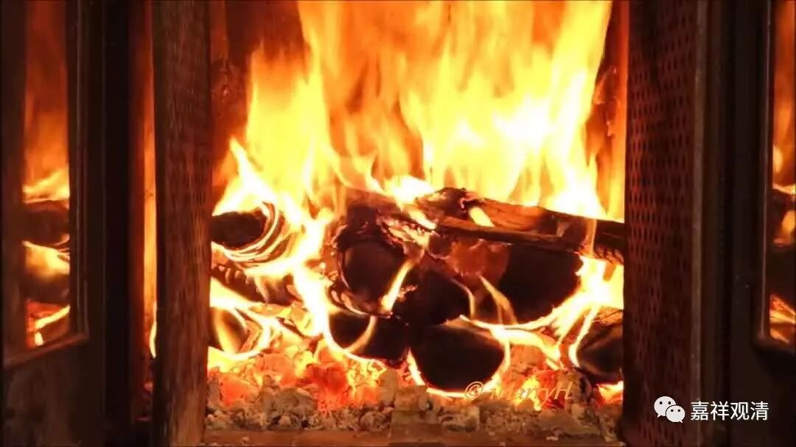

**保宁仁勇禅师**

** 禅门路滑**

保宁仁勇禅师，四明山（宁波）人，原来学天台教理，后为杨岐方会禅师（临济宗下开杨岐派）弟子，白云守端禅师的师弟，后住保宁寺开法。他参与编纂了《杨岐方会禅师语录》。有《保宁仁勇禅师语录》传世。

《五灯会元》卷十九收录了他和学僧这样一段问答：

** 僧问：“如何是佛？”**

** （保宁仁勇禅）师曰：“近火先焦。”**

** 曰：“如何是道？”**

** 师曰：“泥里有刺。”**

** 曰：“如何是道中人？”**

** 师曰：“切忌踏着。”**

看起来完全摸不着头脑，但其实它涉及到当时禅门的“典故”，下面解释字面和背后的意思看看。

一、“什么是佛？近火先焦！”

“近火先焦”，这是说的木头。这个回答隐含了一个常见的问题：“（木）佛像是佛吗？”

仁勇禅师之前的丹霞天然禅师就有给木佛烧舍利的公案：

《五灯会元》卷五：

** （丹霞天然禅师）后于慧林寺遇天大寒，取木佛烧火向。**

** 院主诃曰：“何得烧我木佛？”**

** 师以杖子拨灰曰：“吾烧取舍利。”**

** 主曰：“木佛何有舍利？”**

** 师曰：“既无舍利，更取两尊烧。”**

丹霞天然禅师把木佛劈了烤火。

住持火了：“你这和尚！好好的干嘛把我们庙里佛给烧了？！”

丹霞天然禅师拿棍子拨弄拨弄碳灰：“我这不是在烧舍利吗？”

住持说：“唉，看来是个傻和尚！木佛哪能烧出舍利来啊！？”

禅师说：“那好！既然没舍利，帮忙把那边两尊搬过来烧烧！”

二、“如何是道？泥里有刺！”

“泥里有刺”，说的是道路的“道”——“道”路上的泥里有刺。其实本身并非直接相关，近似偷换概念。但这是一个双关语（甚至三关语）。“泥里有刺”是禅门的一个常见的回答，用在各种不同的地方，是一个时代的语言，略如十年前的“酱紫”。如《圆悟佛果禅师语录》：

** ……（有僧）进云：“‘智藏道：问取海兄去’又作么生？”**

** 师云：“烂泥里有刺。”**

** （问）：“‘百丈道：我到这里却不会’意旨如何？”**

** 师云：“乌龟钻破壁。”**

** ……**

**
**

（这里其实单引号里又引用到另一则公案。且不提他。这里意思是：智藏法师那句“你去问百丈怀海禅师”是话里有话，不简单呢！）

书玉律师《沙弥律仪要略述义》也提到“泥里有刺”（其实还有很多地方）：

“古人悟后问答，如电影穿针，丝来线去，亦如水面回纹，飞花点缀。虽是家常语言，须知泥里有刺也！”

这是说，“虽是家常语言，但要知道这里面是‘泥里有刺’啊！”意思是：禅师们的平常话里有机锋呢。

好，回来解释保宁仁勇禅师的第二个回答：别人问“什么是道”，他回了一个双关（三关）语：1、“道（路）”上的泥里有刺（把“道”理解成“路”）；2、“道（说）”，就是“泥里有刺”，平常“话”里有机锋（把“道”理解成“说”）；3、道，就是平常话里有机锋（把道，理解成“禅”宗的要义）。

三、“如何是道中人？切忌踏着。”

和上面相关，1、路上的人别踩着刺；2、注意别被语言骗了；3、别错过机锋。

其实还有第四层意思：

三个问题合起来正好问的是三宝“佛法僧”！

什么是佛？——这是问“佛”；

什么是道？——这是问“法”；

什么是道中人？这是问“僧”。

