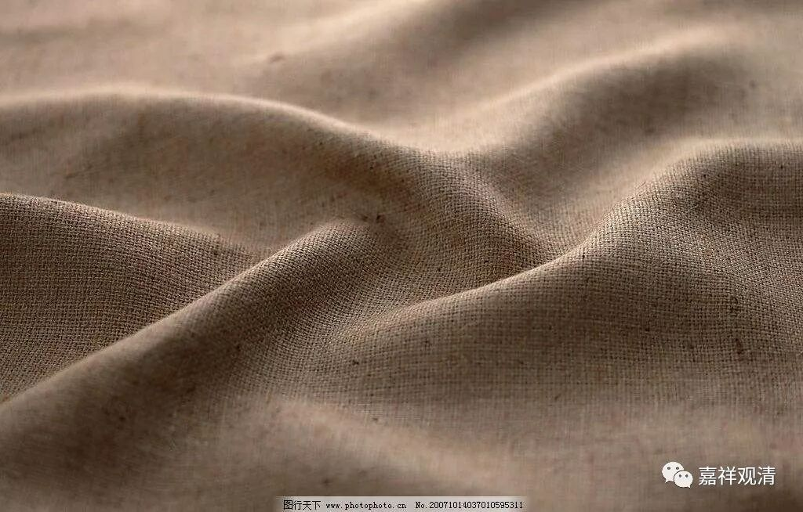
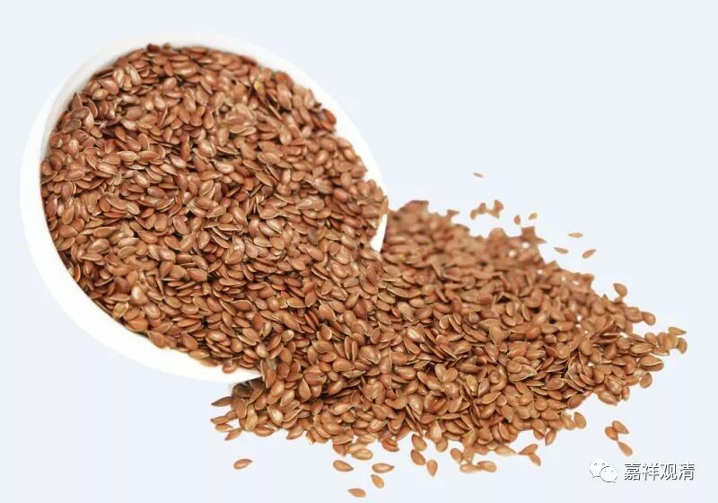
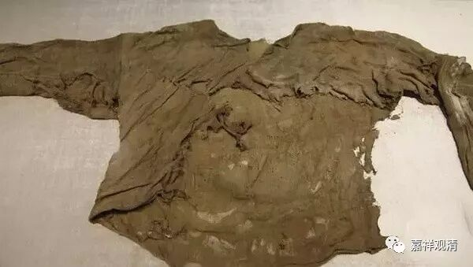
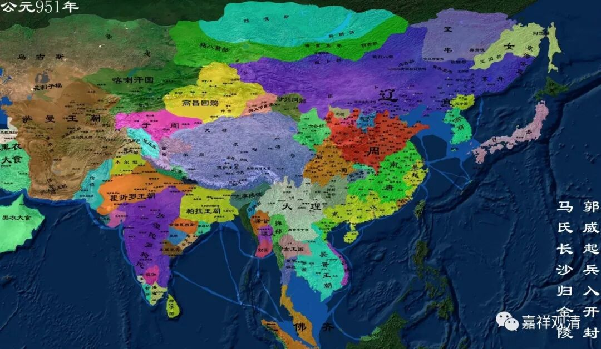
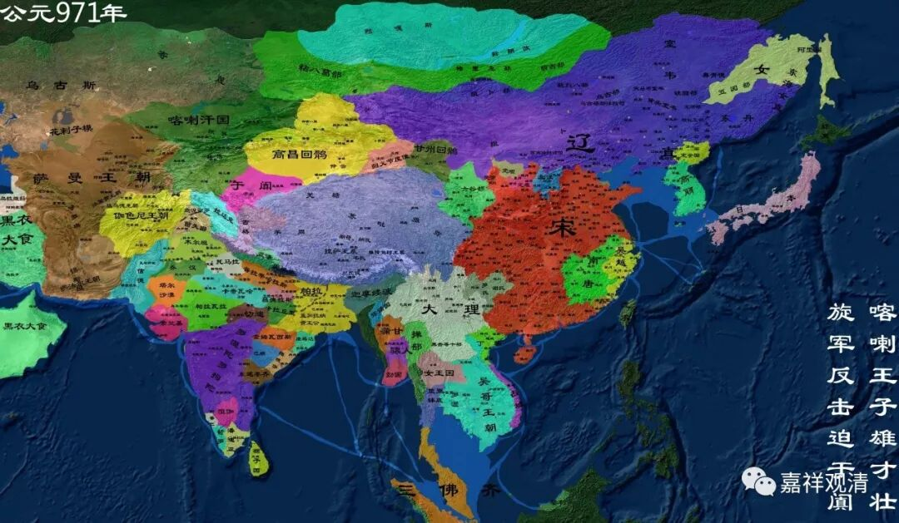

**洞山守初禅师**

**
**

** 麻三斤**

洞山守初禅师，陕西凤翔人，云门文偃禅师弟子，后驻锡江西洞山。他有一则公案，禅宗里面非常有名——“麻三斤”。

《佛祖纲目》：

“（僧）问：‘如何是佛？’

（洞山守初禅师）曰：‘麻三斤！’”

有人问：“什么是佛呢？”洞山守初禅师回答：“麻三斤！”公案很简洁，但各路“禅师”给以发挥，有说是“洞山眼前之物”，有说是洞山禅师正在称胡麻，有说是截断众流句……呵呵，禅师称胡麻做什么呢？

** （油料作物——胡麻）**

这又涉及到一个典故了，就是唐朝的税收制度。如果不知道这个，就会产生五花八门的解释了。

唐的税收制度，从初期的租庸调制，到后期的两税制……其租庸调制中，据《唐六典·尚书户部》记载：

** “赋役之制……课户每丁租粟二石。其调，随乡土所产，陵、绢、絁各二丈，布加五分之一，输绫、绢、絁者，绵三两，输布者，麻三斤。”**

《旧唐书·食货志》：

** “赋役之法：每丁岁入租粟二石。调则随乡土所产，绫、绢、絁各二丈，布加五分之一。输绫、绢、絁者，兼调绵三两；输布者，麻三斤。”**

（出土的麻衣）

“麻三斤”是一个固定用词，是唐代税收租庸调制度中之“调”，也就是，唐初实物税收，每人每年，三斤麻布。所以这个“麻”，不是胡麻，是麻布！这是唐代每个人都知道的事情。

作为僧人，起初是不用缴纳税收的，所以，僧人是免输“麻三斤”的。但唐代后期实行两税制，对僧人的“免税”改成了“免役（徭役）”就是僧人也要缴税了。

考洞山守初禅师，“守初，住洞山四十年……淳化元年秋七月，无疾而化，寿八十一。”生卒则为公元909～990年，公元950年以后在洞山。此时，当五代至宋初（淳化元年为公元990年，宋太宗时期的年号），守初禅师至洞山时（公元950～990年）主要在南唐至宋初……

（公元951、971年的中国历史地图）

这一时期的税制又有了变化，宋初僧人也要缴纳“免丁钱”（因免税、免徭役而收钱）。

《宋史·高宗纪八》:

** “（绍兴 二十九年九月）丁酉，减僧道免丁钱。”**

减“免丁钱”，就是之前要缴纳“免丁钱”……

僧人税收的事情，先谈到这里。

这里要说明的是，作为人人要交的税，“麻三斤”绝不是洞山守初禅师随口说说的。当时，“麻三斤”的税收制度已经过时，僧人的免税福利也已经被改变，那这里“麻三斤”的意思就不是“务虚”而是“落实”的！

知道了“麻三斤”的来龙去脉，也许这个公案应该务实地解读了。

问：什么是佛？

答：都老掉牙的问题了还在问！

