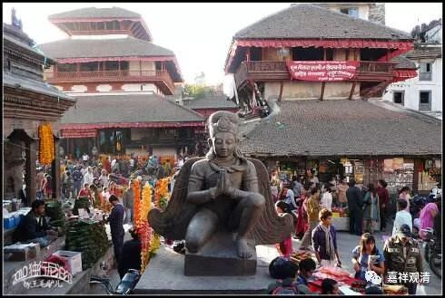

**《菩提速道》讲记040（上）**

有时候他们会对管家进行比较的。比如说今年是魏老师做铁棒喇嘛，明年观清师，后年龙智师做，他们就会在外面说：“哎呀，这三年里面，观清师这个人福报大啊！我们念经就从来没有停过。”因为念经的话，他们就会有供养嘛，那就从来没有停过。“哎呀，魏老师一塌糊涂，我们那年饿都快饿死了。”于是江湖上就开始传说“观清师福报大”，那么他做其他事情的时候也会很容易，因为整个寺院都在传说：“观清师福报大，观清师福报大。”这样就会形成一个舆论，其实对他们来说，舆论是很重要的。

当然，还会有另外的问题，就是当大家都在传说“观清师福报大”的时候，就会有人到观清师的府上来“化缘”、借钱，如果不给钱，他们就会在外面说：“这个人不好，唉，我们这么好的兄弟居然钱都不借，抠门死了！”

现在步入信息社会，他们却是没有什么实质上的变化。怎么说呢？我们一直都在讲要走出中世纪，他们的思维可能还没有走出中世纪，很多思维还跟不上，还没有现代化。比如，现在跟以前不一样了，现在坏账非常多，而以前坏账的情况是很少见的。现在很多西藏人是不怎么信佛的，而且你要知道，有些事情是不能有第一个带头的。比如打仗的时候：“共产党员们，跟着我冲！”一个人冲出去，之后就有二十个人冲出去，连不想冲的也没有办法，只能冲，“死就死吧”。这个也是啊，只要有一个人不还贷，其他人就跟风了：“噢，他不还贷，哎呀，那我也破产了。”一算账，一百万放出去都收不回来了。

唉，他们寺院（管家们还是原始的资金管理方式，）根本没有控制风险的意识。我跟他们说：“你们一定要有财务管理的意识，最好有个财务总监来帮你们做事。”我说了三回，结果还被骂了。我的意思是，他们的财务制度不够先进，本来一块钱可以当十块钱用的，结果十块钱只当一块钱用……算了，不说了。

藏地寺院到现在还是放贷的，就像刚才讲的，观念还跟不上现代的节奏。其实他们到现在都很难接受放贷的利率年息在10%以下，这是他们很难接受的。他们一般认为利率应该在16%到25%之间浮动，10%的利率他们认为是太低了，25%他们认为是很正常的。他们的利率这么高，所以真的有些和尚就因此而破产了。有些和尚问寺院借钱，结果利滚利，到时候就还不出来了。

但好的情况是什么呢？就是这么多年以来，寺院的房地产也在升值。江湖上外面的房地产在涨，寺院的房地产也在涨。因为很多家庭都有钱了，家里的孩子出家的时候就会给孩子买一个稍微大点、稍微好点的房子，结果寺院本身的房价也上去了。有些和尚就熬上几年，实在还不起寺院的钱呢，就等寺院的房价上去了以后开始卖房子。有些是割一半卖，或者卖全部，自己再去租别人的房子或者租寺院的房子。寺院里面穷的和尚也是有的嘛，而寺院本身也会有一批房子，于是他们就把自己的房子卖了，然后再“租”寺院的房子——“租”寺院的房子是不需要花钱的，但是要干活儿，承担部分责任……所以寺院的房地产现在也是涨得很厉害。

寺院放贷坏账不是利率高的原因，和以前相比，以前的坏帐很少的，现在其实是因为越来越多的人不信佛了。不信佛，但是却问寺庙去借钱，然后又说：“我不还了。”……现在的寺院经济其实很有趣的，在转型期，完全可以写篇论文，你要写论文的话我可以带你去一趟了解一下。

