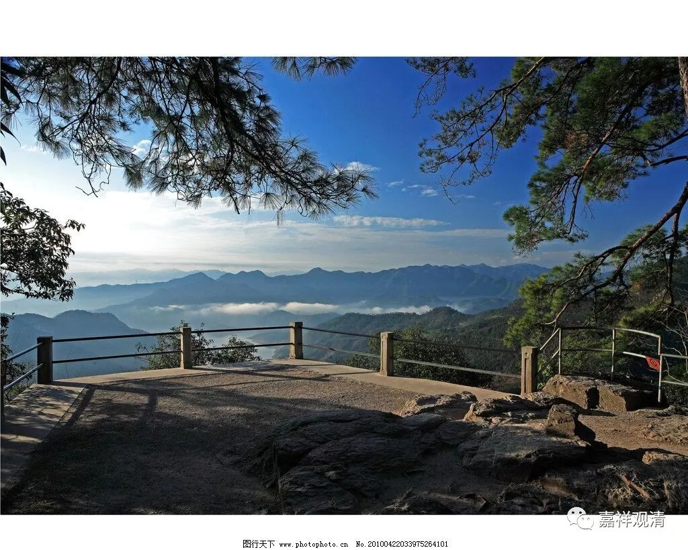

**《菩提速道》040（下）**

** “‘涂香’指芬馥沁人肺腑的香水、香膏等。‘伞盖’指华美的宝盖。‘灯烛’指供养芳香的酥油灯等，芬芳而明亮，以及夜明珠等，”**你看到没有？夜明珠派这种用处的——照明。** “光明普照，似乎不能分辨昼夜。‘薰香’指配制的合成香，”**现在巴丹师（八吨红木的巴丹师）也在配香。他挺钻研的，说在熏香里面用汉文翻译过来叫“郁金”的，实际上是红花。我听他说的很有道理啊，因为郁金是球茎类的，藏红花也是这种球茎类的，所以当时很可能就把这个词翻译成郁金了，所以藏香的味道是因这类（配错药）而有点特别的。

还有一点，藏香在我们闻起来有点冲鼻，什么原因呢？我觉得他讲的也是有道理的。因为藏地相对是缺氧的，在他们那里的一点点氧气烧出来觉得比较一般的香，在我们这里相对富氧的环境下，那肯定味道是重的。那些喜欢西藏的文青们就像追风一样去追风西藏的香，是吧？实际上完全按照原方原样制作的藏香是不很适合我们的，它的味道应该再淡一点。就是给我们汉地用的时候，应该配料还要再淡一点，再加一点添加的赋型剂也行（他们不太愿意加添加剂），或者做得小一点、细一点。否则他们的这个香我们闻起来一定是味偏重的。他们的香一般做得比较威武雄壮，太粗了，那烧起来味道也会相对有点重，相对封闭的佛堂里烧一根，鼻子一会儿就……。

而且还有一点就是，其实很多香料西藏是没有的，他们就用了很多替代品。比如刚才讲的郁金这些，可能也没有，有些小厂，一些金银之类的配料也没有放，这些就不说了。另外呢，沉香、檀香等等，西藏也不多，很少的，都用替代品的。他们那里大量的都是松脂——油松，所以闻起来烟味很冲。

** “如现在传称的长线香，以及如沉香、杜若噶香等天然的纯种香。**

** **

** ‘最胜衣服’指最好的衣物。‘最胜香’为馥郁氤氲溢于三界的香水等。‘末香烧香’指可撒的香粉、可薰燃的香袋、画坛城的彩粉等。各种供品堆积起来，巍峨壮观，犹如须弥山王一般。”**意思就是很好很好、很多很多的香、衣物，堆成一个个高山一样的。就是通过观想的力量，或者再念个咒，把它变得很大很大、很高很高的样子。

** “‘庄严具’，结合在前面一切供品的后面，有量多、庄饰、种类繁多之义。”**就是有这么多这么多的好东西，非常非常多，全部都用来作为庄严、装饰。

