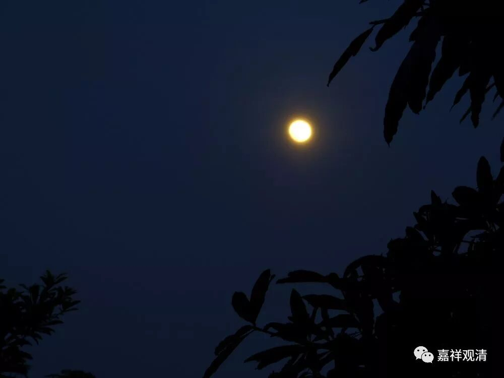
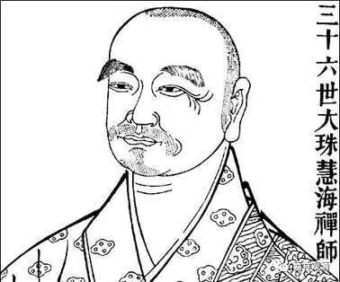

**大珠慧海禅师**

** 饥来吃饭困来眠**

大珠慧海禅师，福建人，马祖道一禅师门下，他有一个公案，今人都完全错解了。我们来看。

《景德传灯录》卷六：

** 有源律师问：“和尚修道，还用功否？”**

** 师曰：“用功。”**

** 曰：“如何用功？”**

** 师曰：“饥来吃饭，困来即眠。”**

** 曰：“一切人总如是，同师用功否？”**

** 师曰：“不同。”**

** 曰：“何故不同？”**

** 师曰：“他吃饭时不肯吃饭，百种须索；睡时不肯睡，千般计较。所以不同也。”**

** 律师杜口。**

源律师问：“大师修道，还用功吗？”

（大珠慧海禅师）说：“用功啊！”

源律师问：“怎么用功呢？”

禅师回：“饥来吃饭，困来即眠。”

律师说：“大家都这样啊，也和大师您一样在用功吗？”

回：“当然不一样咯！”

问：“哪不一样呢？”

禅师说：“他吃饭时不肯吃饭，百种须索；睡觉时不肯睡觉，千般计较。所以很不相同啊！”

律师被说的哑口无言。

外行人看这句“饥来吃饭，困来即眠”，以为是禅师过来人的一副潇洒做派，“饥来吃饭困来眠，仿佛逍遥活神仙”。大儒王阳明就说：

** “饥来吃饭倦来眠，**

** 只此修行玄更玄。**

** 说与世人浑不信，**

** 却从身外觅神仙。”**

明·王象珅也说：

** “问予何事容颜好，**

** 曾受高人秘法传。**

** 打叠身心无一事，**

** 饥来吃饭倦来眠。”**

这都是以为，“饥来吃饭，困来即眠”就是任性逍遥的悟后境界，其实完全都看错了禅师的意思。

首先，这句话回答的是“用功”，“饥来吃饭，困来即眠”这句话本身不是对“如何用功”的正面回答，是禅师的惯用的转折，意思是——“除了吃饭睡觉，我都在用功”。就像今天，你问：“大师最近如何（闭关）用功呢？”他回答：“除了吃饭睡觉，都在办道呢……”这个才真的是用功人的话嘛。

那么上面那则公案后面一半的问答是怎么解释呢？

源律师顺着“饥来吃饭，困来即眠”的话头往下说“大家都这样啊！”而大珠慧海禅师后面的回答更令大家加深了误解，因为这第二个误解，而对上面那句“饥来吃饭，困来即眠”有了指向性的错误解读。

“吃饭时不肯吃饭，百种须索；睡时不肯睡，千般计较”，这是说“吃饭时弄一堆事，睡觉时又弄一堆事”。这是针对源律师说的，意思是：“你们学律的吃饭、睡觉都搞很多仪式，我们没有！”所以后面才有“律师杜口”这句。很多人先把后面这句理解为“吃饭时不好好吃饭，睡觉时不好好睡觉”，拿这句去参照上面的“饥来吃饭困来眠”，把“饥来吃饭困来眠”理解成正面回答，于是变成“饥来吃饭困来眠”就是“用功”、就是办道，那真是大错特错了！

我们来看另一个著名公案（不全引了），见《继灯录》卷四：

** ……岩（即雪岩祖钦禅师）嘱（高峰元妙禅师）曰：“从今日去，也不要汝学佛学法，也不要汝穷古穷今，但只饥来吃饭困来打眠。才眠觉来，抖搜精神看，我者一觉，主人翁毕竟在什处安身立命。”……**

“饥来吃饭困来打眠”在这里的意思就是“除了吃饭睡觉，你给我好好打坐参禅”，而不是“你只管吃饭睡觉”的意思。

《永觉和尚广录》卷三也说：

** “僧问：‘者箇分明在目前，饥来吃饭困来眠’，此外还有事也无？**

** 师云：未尝无事……**

** 师（永觉元贤禅师）乃云：今时人，但言‘饥来吃饭，困来打眠’，千休万歇，便尔承当。殊不知其中大有事在！老僧今日不免为渠指出。”**

有僧人问永觉元贤禅师：“‘这个分明在眼前，饥来吃饭困来眠’，这以外还有事儿吗？”

永觉元贤禅师回答：“不是没事儿啊！今人都只会说‘饥来吃饭困来眠’，以为是千休万歇、直下承担的过来人话语，其实这里面还大有事在！老僧我今天不免要为他指出来……”

如上所说，今后大家不要错认“饥来吃饭困来眠”本身就是修行、就是任运自在的过来人的写照，其实那是说“除了吃饭睡觉都在用功”啊！

如果觉得说的有道理，请转发本系列《门外谈禅》