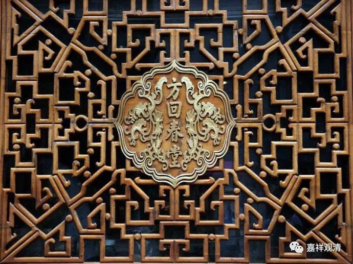
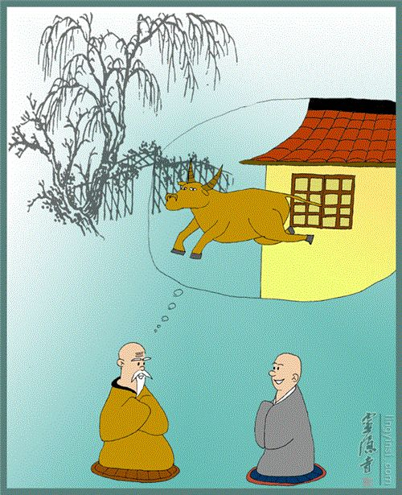

**五祖法眼禅师**

** 牛过窗棂**

五祖法眼禅师，俗姓邓，绵阳人，他三十五岁出家，先学《唯识》（《成唯识论》）、《百法》，后又学禅，依白云守端禅师为弟子。后来住五祖山（东山），为当时著名禅匠，是圆悟克勤禅师之师。

五祖法眼禅师有一则公案为后世百般评唱，也常常令学者摸不着头脑——“牛过窗棂”。

《五灯全书·蕲州五祖法演禅师》：

** 师（五祖法眼禅师）曰：“譬如水牯牛过窗棂，头角四蹄都过了，因甚尾巴过不得？”**

五祖法眼禅师说：

“就像有水牛过窗棂（窗格子），头角四蹄都过了，为什么尾巴过不了？”为什么不可思议、很难的事情都过了，剩下一点小小的简单的东西却被障碍住了呢？

这个话头好像有点难参……

呵呵，其实并不难，问题出在一向所说的知识背景问题。五祖法眼禅师原来学唯识，而学唯识者多兼学《俱舍》，《俱舍论》里提到“讫栗枳王梦所见十事”，法宝《俱舍颂疏》说：

** “‘讫栗枳’，是梵语，此云‘作事’，是迦叶佛父。夜梦十事，且具白佛。佛言：‘此表当来释迦遗法弟子之先兆也。’（第一梦：）王梦见一大象被闭，更无门户，唯有小窗。其象方便其身得出，唯尾碍窗不得出也——此表释迦遗法弟子，能舍父、母、妻、子出家修道，而于其中犹怀名利，不能舍离，如尾碍窗。”**

说讫栗枳王（迦叶佛的父亲）梦十事问迦叶佛，迦叶佛说那是关于释迦佛时期弟子们的预言。第一梦，是梦到有大象被关在没有门的屋子里，大象有办法从小窗出去了，可是尾巴却被窗户隔碍住了出不来。这是预示释迦佛未来的出家弟子们，能舍父母妻子，却被名利所累，不得出离。

原文是“大象过窗棂”，法眼禅师举“水牯牛过窗棂”，以牛替象，那是洋为中用了，而其余意思，和出典处一样，是说：“大众，你们舍离父母妻子而出家办道，不要去追求名利而障碍了解脱！”

《俱舍》所说的“讫栗枳王梦所见十事”，则出自《佛说给孤长者女得度因缘经》卷下：

** （迦叶佛时期，）时彼哀愍王，忽于一夜得十种梦：一者梦见有一大象从窗牖出，身虽得出尾为窗碍……**

** （迦叶）佛言：“大王！勿怖勿怖！如所得梦皆非汝事，亦非今时善恶之相，于汝寿命亦无损失。大王当知，是未来世中人寿百岁时，有佛出世名释迦牟尼十号具足，彼佛住世演说诸法教化众生，如其所应作佛事已而入涅槃，入涅槃后于遗法中苾刍弟子诸所作事，王今此梦是彼前相，我今为王次第而说。如王所梦有一大象从窗牖出，身虽得出，尾为窗碍者，是彼佛入涅槃后，于遗法中，有婆罗门、长者、居士、若男、若女，弃舍眷属，出家学道，虽出家已，心犹贪著名利俗事，不能解脱……”**

这正是：

** 蛟龙腾碧汉，犹忆旧池深。**

欢迎转发