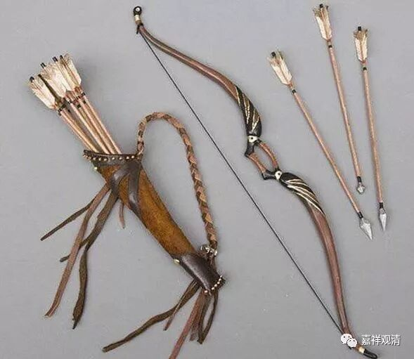

**石巩慧藏禅师**

** 猎人出家**

马祖道一禅师在禅宗史上可谓声名赫赫，门下善知识如云。其中有一位石巩慧藏禅师。

《江西马祖道一禅师语录》：

** 石巩慧藏禅师，本以弋猎为务，恶见沙门。因逐群鹿，从祖庵前过，祖乃迎之。**

** 藏问：“和尚见鹿过否？”**

** 祖曰：“汝是何人？”**

** 曰：“猎者。”**

** 祖曰：“汝解射否？”**

** 曰：“解射。”**

** 祖曰：“汝一箭射几个？”**

** 曰：“一箭射一个。”**

** 祖曰：“汝不解射。”**

** 曰：“和尚解射否？”**

** 祖曰：“解射。”**

** 曰：“和尚一箭射几个？”**

** 曰：“一箭射一群。”**

** 曰：“彼此是命，何用射他一群。”**

** 祖曰：“汝既知如是，何不自射？”**

** 曰：“若教某甲自射，即无下手处。”**

** 祖曰：“这汉！嚝劫无明烦恼，今日顿息！”**

** 藏当时毁弃弓箭，自以刀截发，投祖出家。**

这则公案一般文字好懂，不解释了，但后面很多人都有误解，需要解释一下。

……猎人（后来的石巩慧藏禅师）说：“彼此是命，干嘛射一群呢？”

马祖道一禅师说：“你既然知道（彼此是命而又射一只），那你干什么不射杀自己呢？”

猎人说：“呃，让我射杀自己？！我下不了手啊……”

马祖道一禅师说：“你啊！旷劫的无明烦恼（杀生的罪业），今天还不放下！”

猎人善根激发，知道自己杀生之错，当下忏悔，毁弓弃箭，剃发出家了……

这是一个禅师应机度化猎人的故事，却被文盲们吹成猎人“杀取有道，不失本心”，并把“一箭射一群”也做了莫名其妙的解读。呵呵，宗门事，没文化的还是莫来多嘴的好。

