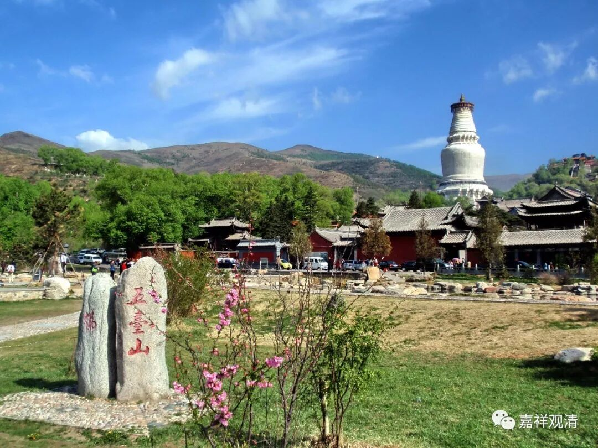

**《菩提速道》041（下）**

** “如果不以追悔昔恶、防护未来的心至心地忏悔，则自己内心未生的功德不会生起，已生之功德也会渐渐退失。”**如果你不觉得以前是错的，也不觉得将来你要防护的话，你的“忏悔”也是没用的。

我还是举例子吧，就用医生和病人的例子。大量的病人都是这样：他也不觉得自己以前有多不对，也不觉得以后我需要忌嘴或者需要锻炼，然后好像医生是他的仇人一样，他生重病的时候就稍微对付对付医生，回去以后又该吃啥吃啥，该喝啥喝啥，最后其实倒霉的是他自己。

我们的修行其实也是一样的，好像佛菩萨们都是对我们有啥企图一样。我们有事，就稍微请他帮帮忙，结束以后呢，我们又重新故态复萌，是吧？还是那样，以前是什么样还什么样。有时候也是我自己修行不好，看到那些不听话的病人其实真的心里面很生气、很烦、很可气。老实说，我真想说：“你别来看病了，真的没有意义，你根本就不相信，你根本也不把自己的病当回事儿，你折腾自己，还折腾自己的家人。”

我们周围这样的人很多，病人大部分都是这样。如果你能够听医生的，知道自己以前错了，而且以后这个再也不做了，那就容易了，是吧？比如拿我自己来说，结果就是不能再吃了，是吧？但还是没忍住，走了6000步，还没有吃那么一点点坚果有用。突然间发现：“诶？今天没干什么，怎么又重了2斤啊？”想了想，是吃了一包坚果。其实我自己也是这样的，对吧？这个以后要注意了，坚果不能再吃了。

那么如果真正的这样追悔了，也不舍命也不造恶，负面的事情他不去做的话，这个会有一些，也就是说佛所讲的应该有的证得，你会渐渐的生起，比如说你生病的话，这些病以后会慢慢慢慢的消亡，或者至少它不会增长。有些呢，就刚才我们聊的也是，有些师父们也是没办法，他用身体去换一些其他的东西（明知辛苦，还要作陪……）。

** “若对自己过去所作之罪如腹中毒一般至心地追悔，以后舍命也不再造恶，至心地生起防护，那么，过去未生的功德将会新地生起，已生的功德将会辗转增长。**

** **

** 因此，过去诸先觉大德都极为重视忏悔罪堕。阿底峡尊者来藏途中，略有小过，立即驻扎商队，供养曼扎，至心忏悔，然后说，现在可以出发了，这个过失若未忏悔我就死去，必将令我堕入恶趣。”**这个就是榜样，阿底侠尊者，觉得自己戒律稍微有点不对的地方，马上忏悔。

** “就这样，无论走到哪里，尊者总是手托木塔，随时忏悔并发防护的心，说不可与罪堕共处一昼夜。”**所以，一般我们都是说在睡觉以前，念念“金刚萨埵百字明咒”，就是不要让罪堕过夜，就是忏悔的意思。如果看阿底峡尊者的唐卡，一定会有一个塔，左手边，都一定会有一个塔。

