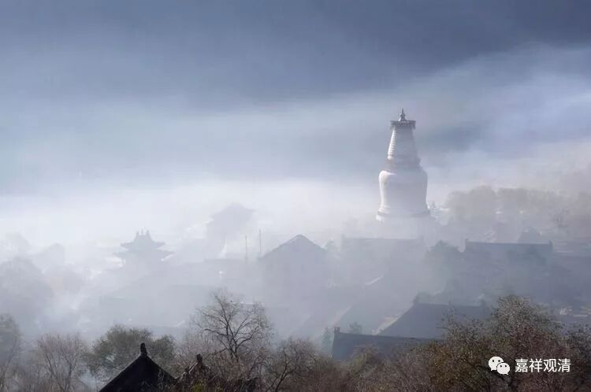

**无著文喜禅师**

** 前三三与后三三**

无著文喜禅师，嘉禾人（不知道是浙江嘉兴还是福建建阳，前者可能性大），七岁出家，后为仰山慧寂禅师弟子，住锡杭州龙泉寺。

无著文喜禅师有一个有名的传说故事——五台山见文殊。（此故事被收入《神僧传》。）

无著文喜禅师三十岁左右曾拜访大慈山性空禅师，禅师嘱咐他要多参访善知识。于是赴五台山，住华严寺。

他去金刚窟朝礼的时候，路上遇见一老翁牵着牛。老翁邀请他进了一座金碧辉煌的寺院，自己坐在禅床上，让文喜禅师坐在锦墩上，聊起了家常……

问：“你从哪里来啊？”

“南方。”

问：“南方佛法现在怎么样啊？”

文喜禅师说：“末法比丘，少奉戒律。”

又问：“各寺院人数多少啊？”

文喜禅师回答：“有的三百，有的五百。”

文喜禅师也问老翁：“这边（五台山）佛法怎样啊？”

老翁回答说：“龙蛇混杂，凡圣同居。”

文喜禅师问：“多少人呢？”

老翁回答：“前三三，后三三。”

……后乞留一宿，未获允可。有童子送其下山。文喜禅师忽然想到，便问童子：“这是什么寺院啊？”童子回答：“金刚窟般若寺！”禅师恍然大悟——原来刚才的老翁就是文殊化现啊！再看童子与寺院，均已不见，五色云中，文殊大师骑在金狮子之上，渐隐没于白云之中……

此故事为传说或是真实，自是见仁见智，但有其真实背景。文喜禅师，生卒年为公元820——899年，唐末人。七岁出家后，在二十岁头上，正逢唐武宗会昌法难（公元842-846年），此时被迫还俗，于大中（847年正月—860年十月）初年近三十岁时，再次剃度出家。此时河北之“河朔三镇”虽未被法难波及，但相邻的代州五台山则受到比较大的冲击，会昌四年三月曾明令禁止五台山祭拜舍利……所以老翁与来自南方的文喜禅师（在佛教恢复秩序以后）要互相交流各地寺院人数多少、僧人素质高低、佛法传播情况。

这段公案里，“前三三与后三三”是一个“梗”，大家都在猜是啥意思。我也猜猜玩玩：

前面说“龙蛇混杂、凡圣同居”，这里的“前三三后三三”……可能指比例——顶尖的圣人、落后的凡夫、中庸的行者各占三分之一。

