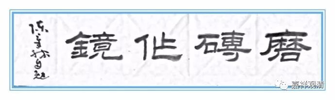
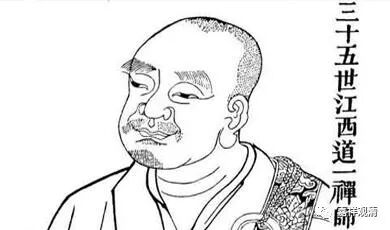

**马祖道一禅师**

** 磨砖作镜**

马祖道一禅师，俗姓马（故称马祖），四川什邡人，幼年出家。据称道一禅师容貌特殊，能引舌至鼻，足下见有轮相。

唐开元年间，道一禅师在南岳衡山的传法院住下学修禅定，遇到了他后来的老师——南岳怀让大师（六祖慧能禅师之高徒）。

南岳怀让大师发现道一禅师是个法器，就诱导地问：“大师坐禅图什么呀？”

道一禅师回答说：“愿成佛！”

怀让大师也不多说什么。找来块砖，在道一禅师的茅棚前面嘎吱嘎吱磨砖。（这是存心找话啊，人家打坐，他磨砖，吵死人啊……总算好，没拿钝刀刮锅底。）

道一禅师（估计实在憋不住了）说：“大师磨砖做什么？（明知道我在打坐，这不是捣乱嘛！）”

怀让大师说：“我磨砖做镜子啊！”

道一禅师（大概觉得自己今天碰到怪人了）问：“磨砖怎么能做镜子呢？”（其实我觉得金砖、银砖、铜砖都可以磨做镜子嘛。）

怀让大师看对方中了自己埋伏，便停手，反问到：“磨砖既然不能做镜子，那打坐怎么能成佛呢？”

道一禅师还没有反应过来：“什么意思？（这两句话之间有关联吗？）”

怀让禅师问：“就像牛拉车。车不动了，你是赶牛呢，你是打车呢？（打车啊，滴滴……）”

道一禅师一时语塞。

成佛是要修心，而不在打坐。前者是内容，后者是形式，形式是为内容服务的。单纯的程式化的“修行”，恐怕不能合解脱道。

时至今日，师父们也应该去某些闭关房门口磨磨砖头，再去捏捏徒弟们的鼻子，喝一句：“磨砖不能做镜，摇铃岂能成佛？！”

白云清禅师曰：

频频负薪救火，

再再扬汤止沸，

不免隔靴搔痒，

实当釜底抽薪！

** 《江西马祖道一禅师语录》：**

** 唐开元中，（道一禅师）习定于衡岳传法院，遇让和尚。**

** （南岳怀让禅师）知是法器，问曰：“大德坐禅图什么？”**

** 师曰：“图作佛。”**

** 让乃取一砖，于彼庵前磨。**

** 师曰：“磨砖作么？”**

** 让曰：“磨作镜。”**

** 师曰：“磨砖岂得成镜？”**

** 让曰：“磨砖既不成镜，坐禅岂得成佛耶？！”**

** 师曰：“如何即是？”**

** 让曰：“如牛驾车，车不行，打车即是？打牛即是？”**

** 师无对。**

