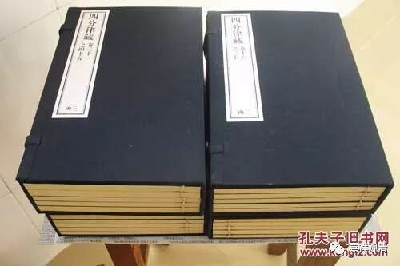

**大珠慧海禅师**

** 谁在“落空”？**

大珠慧海禅师，我们已经提到过他一次了，这次，我们看看他对外的辩论水平。

有一位法明律师来拜访，对大珠慧海禅师说：“你们禅门的人多落空啊！”（清案：这里的“落空”，指“不落实”。禅宗自称所谓“教外别传”，所以别派对他们的印象常常是不合经教地“落空”。这里的“落空”不是教下说的“断边”。）

大珠慧海禅师马上怼回去：“依我看，倒是大师你们多落空呢！”

法明律师大惊：“我们哪里落空？”

禅师说：“你们看经读论，不外乎语言文字，而语言文字并非他所指向的事物本身，所以不真实。声音、文字、名句等法，无非如此，但执此为实，都可以说‘落空’。大师您寻章逐句，滞于文字，如此这般，岂不‘落空’？！”

律师复问：“那禅门是不是也‘落空’呢？”——你们不用语言文字的吗？

禅师回：“（虽不离文字，却）不落空！”

问：“怎么个‘不落空’？”

禅师说：“我们禅门的文字语言皆从智慧而生，智慧之全体大用现前，又哪里会‘落空’呢？”

法明律师见大珠慧海禅师的嘴皮子这么利索，不免赞叹道：“今天才知道若有一法不通达，就不能叫‘悉达’啊！”（反过来就是说“法法通达，是名悉达”，这是夸大珠慧海禅师懂得真多。此处的“悉达”，就是“悉达多”，是释迦佛的本名，正译为“一切义成”。法明禅师说“悉达”的意思就是全部通达，这是望文生义的汉字解析了，所以被大珠慧海禅师继续纠错。）

大珠慧海禅师继续补刀：“看来律师您不仅滞于文字而落空，还更错解了文字呢！”

法明律师脸上挂不住了，问到：“哪里理解错了？”

禅师说：“律师您连文字是属于汉语还是梵文都没搞明白，还怎么接着说话呢？”

律师说：“请大师明示！”

大珠慧海禅师道：“律师您不知道‘悉达’是梵文吗？（怎么可以拿来做汉文的拆词呢？）”

律师虽然知道知道自己错了，但心里还很不爽……

早期禅师大多通经通教，如德山宣鉴禅师曾注解《金刚经》作《青龙疏钞》，临济义玄禅师曾学《唯识》、《百法》。宗下也常提到“通宗不通教，开口便乱道！”“离经一字，即同魔说！”故宗门、教下并非如水火之不容。至于末世禅流之不学无术者，自不在我们讨论的范围里了……

《景德传灯录》：

** 有律师法明，谓师曰：“禅师家多落空。”**

** 师曰：“却是座主家多落空。”**

** 法明大惊，曰：“何得落空。”**

** 师曰，“经论是纸墨文字，纸墨文字者俱空。设于声上建立名句等法，无非是空。座主执滞教体，岂不落空？”**

** 法明曰：“禅师落空否？”**

** 师曰：“不落空。”**

** 曰：“何却不落空？”**

** 师曰：“文字等皆从智慧而生，大用现前，那得落空？”**

** 法明曰：“故知一法不达，不名‘悉达’！”**

** 师曰：“律师不唯落空，兼乃错用名言。”**

** 法明作色，问曰：“何处是错？”**

** 师曰：“律师未辨华竺之音，如何讲说？”**

** 曰：“请禅师指出法明错处。”**

** 师曰：“岂不知‘悉达’是梵语耶？”**

** 律师虽省过。而心犹愤然。(具梵语萨婆曷剌他悉陀。中国翻云一切义成。旧云悉达多犹是讹略具语)**

** 又问曰：“夫经律论是佛语，读诵依教奉行，何故不见性？”**

** 师曰：“如狂狗趂块，师子咬人。经律论是自性用，读诵者是性法。”**

** 法明又曰：“阿弥陀佛有父母及姓否？”**

** 师曰：“阿弥陀姓憍尸迦，父名月上，母名殊勝妙顏。”**

** 曰“出何教文？”**

** 师曰：“出《陀罗尼集》。”**

** 法明礼谢，赞叹而退。**

