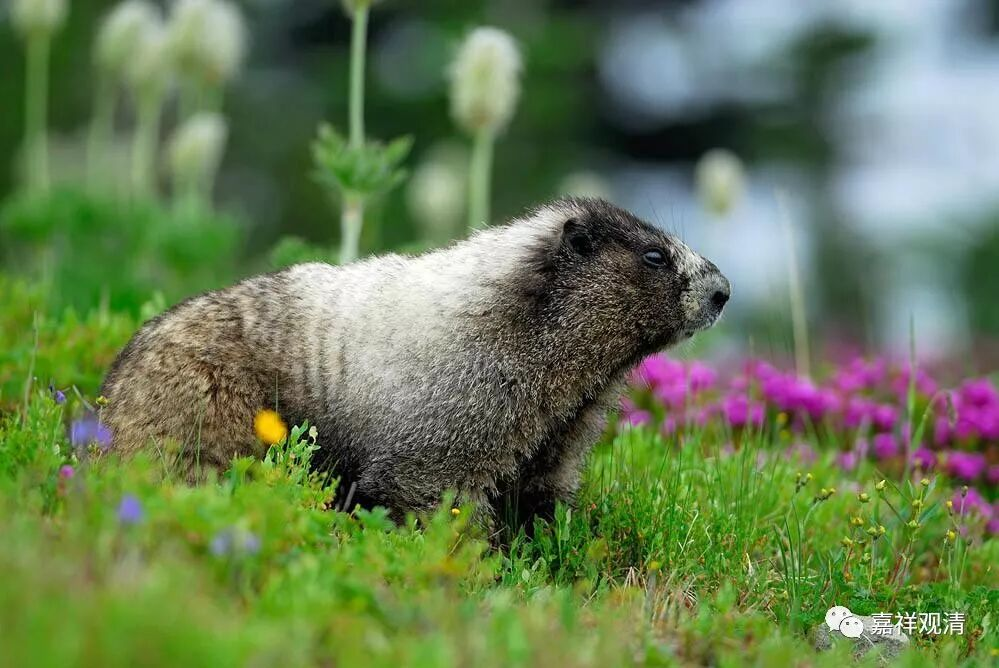

**《菩提速道》042（下）**

** “《戒律大疏》中说，若无猛利不复造罪的防护心，虽诵念‘不敢覆藏，从此制止，永不再犯’之句，罪过不但不能清净，还有妄语的过失。”**口是心非，嘴上念的文字心里完全没反应，这样的念诵忏悔文并不能起到净罪的作用，或者还有诳语的过失。就是其实你在骗人，虽然在念，你并不这么做嘛。这个方面我们自己也要看看，好像我们都是“小和尚念经有口无心”。不过我们这样骗人也不是经常的嘛？每天的修行都念“为利众生愿成佛”，嘴上一直在这么说，碰到了事情就是：“谁敢惹我？”你们怎么样我不知道，我自己大概就是这样的——自以为是无害的土拨鼠，一遇到事却成了豪猪。

** “因此，有说，应数数发起这样的防护心：易断之过，长时间不犯，难断之罪，也应至少一昼夜间不令染犯。如是就有了具备遮止力内涵的要点。”**遮止力就是不做嘛，哪怕你一分钟不做，一个上午不做，它都是不做嘛。你想想，每一个一分钟都不做，不就是一辈子不做了嘛。那么，至少先一点一点地不做，先让它有一个开始，对吧？就像布施也是一样，从一分钱，从一文钱，这样一点点开始，它渐渐渐渐地会长大。

比如说，抽烟啊，喝酒啊，有些人实在戒不了，可以先每天少抽一根，今天就先尝试少抽一根。我们的杨东不是就解决了这个问题了吗？从一根开始，一点一点延长，现在已经不抽了，非常随喜啊！对，你看马上我就随喜他了。这个就是要一点一点——渐渐小小行，每天都少一点点，只要你承诺了，你就要去做到，那么它对你就有约束力了。你如果无视承诺，那承诺就没有约束力，承诺变成了空文，变成了忽悠。

有些人问酒戒怎么受，其实应该酒戒先受，然后再尽量地克制自己不要去喝，碰到机会也尽量不要去喝。受了戒，这就已经有了一定的约束力了嘛。如果实在不行，或者在个别的情况下，“犯戒地狱苦”和“领导不高兴”，你认为哪个更重要呢？当然，真正不能躲避的情况下（虽然我并不认为存在这种不得已的情况），至少你还会忏悔，还会觉得“自己是很不想喝的，很冤枉的”，这样会比较好一点。也就是说，做好事，加行、正行、结行要圆满；那反过来，对坏事，就要让它加行、正行、结行都不圆满……

** “（四）随喜支：对一切自他圣凡三世所积的善根，不是怀着骄矜、轻慢之心，而是至心发起欢喜，则过去所造的一切善品都将会更加的增长广大。”“**随喜”对治的是“嫉妒”嘛。“他有了我很高兴”对“他有了我不爽”。我不知道用什么词最好来解释它的反面，可能最好的一个词就是“不随喜”，就是他做的事情你不是跟着一起高兴的。那么，相反的话，就是他做的正面的事情，你也觉得很高兴：“善哉，善哉！做得好，非常好！”这个方面，我觉得好像净空法师的信徒们会比我做得更好，他们对所有的事情都会生起随喜的心。而我呢，经常是一眼看过去，这个也没做好，那个也是笨蛋。

“随喜”有一个最好的比喻：父母看到孩子做出的成绩，都是由衷的、发自肺腑的高兴（如果不高兴，那一定不是亲生的！）——这是“随喜”最好的注解了吧。老师、医生也是一样，看到学生进步、病人康复，都是从心里满溢出来的欢喜——这样的老师、医生都是天使！

