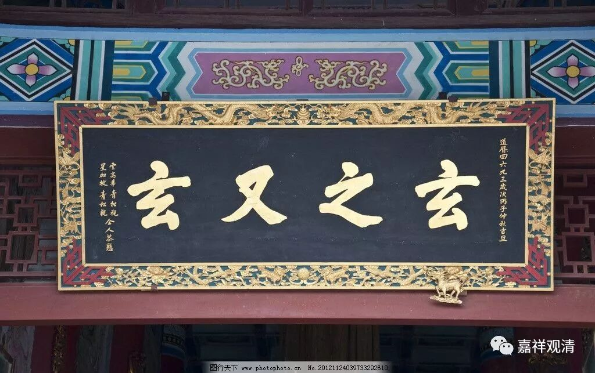
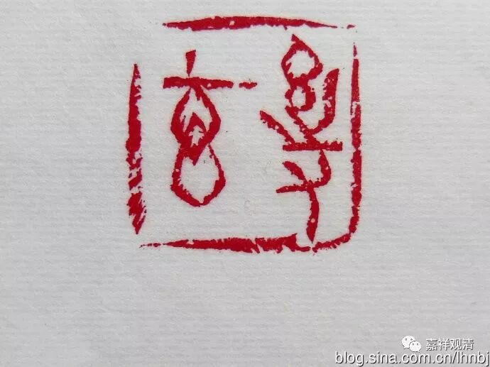

**赵州从谂禅师**

** 玄之又玄**

赵州从谂禅师，被圆明居士（雍正）尊为“古佛再来”，他在宗门可谓无人不知，“赵州无”、“赵州茶”都是最著名的禅门公案。今天谈谈他的直接手段。

** 《景德传灯录》卷十：**

** 僧问（赵州）：“如何是玄中玄？”**

** 师云：“汝玄来多少时邪？”**

** 僧云：“玄之久矣。”**

** 师云：“闍梨，若不遇老僧，几被玄杀！”**

有僧人问赵州从谂禅师：“什么是‘玄中玄’？”

赵州禅师问他：“你这样‘玄’啊‘玄’啊的，‘玄’多久了？”

回：“‘玄’好久了。”

赵州禅师说：“大师！你要不是遇到老僧我，就死在这个‘玄’上啦！”

大凡市面上学禅之人，总以为禅就是“清新”+“玄妙”，总之就是摸不着头脑（之前说过了，其实很多是因为大量的禅宗文献是用当时的俚语白话来记录的，而白话文的变化性很大，不如文言相对固定，所以时间久了便看不懂。五十年后，“蜀黍”、“蟹蟹”、“票圈”这些也是很难理解的术语啊）。更有些喜欢玩机锋转语的，连蒲团都不知道哪面朝上，唾沫星子却已经飞上了天。

赵州大师那时候，禅门里也不乏这样的“高人”，于是被赵州大师“老婆婆禅”地再再劝告：“大师！不要玄啦，再玄就玄死你咯！”

大师还不止一次遇见这类神人——

** 《古尊宿语录》卷十三《赵州真际禅师语录并行状》：**

** （有僧）问：“如何是玄中玄？”**

** （赵州从谂禅师）师云：“说什么玄中玄、七中七、八中八！？”**

又来个和尚，问：“什么是‘玄中玄’？”

赵州从谂禅师回答：“说什么‘玄中玄’、‘七中七’、‘八中八’！”

老和尚真是苦口婆心。

这样的神人还不停地“转世”、“化身”，江湖上哪儿哪儿都是，宋·圆悟克勤禅师也遇着。

** 《圆悟佛果禅师语录》卷二：**

** 问：“如何是玄中玄？”**

** 师云：“玄杀尔！”**

有僧人问：“什么是‘玄中玄’？”

圆悟克勤禅师回答到：“玄死你哦！”

修行要踏实，那些爱谈玄说妙玩机锋的，坐破三五个蒲团后再来道一句也不迟。

