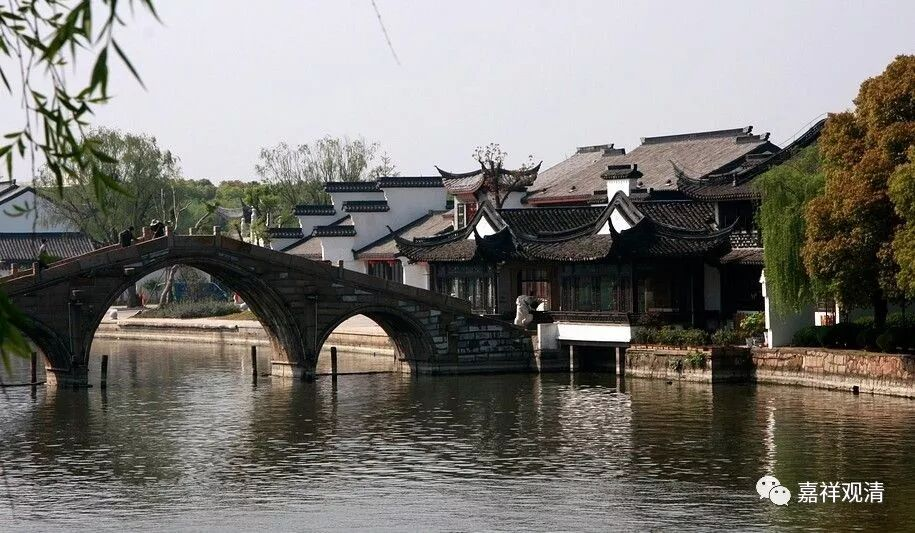

**《菩提速道》043（中）**

** “亦由此缘故，宗喀巴大师曾说过‘以少力而生广大福德’等语。”**因为你有这些善巧的缘故，可以生起广大的福德。是什么善巧呢？随喜！用这个来生起广大的福德。当然，这必须要有发心的背景。你能够做的话，就应该去做。如果是想着“反正我以少力而生广大福德，随喜一下就可以了”，这个福报不见得会大，因为你是贪小便宜的心，并非真实随喜之心。

贪小便宜的心本身就很有问题，按照能海上师的说法，在不杀生的戒律当中，我们要把握的是不能生起伤害别人的想法，而偷盗的核心就是贪小便宜的心。我们却是连修行都想贪点小便宜——最好啥事都不做，但是功德又大得要命。不过，佛已经给了我们机会，给我们画出了一个饼，按照这个来也可以有点好处，又是一个钩子把我们给勾上来——“先以欲勾牵，后令入佛智”。

** “若对于所行之善，心怀骄矜轻慢，则自己的善品不唯不会增长，反将会损耗殆尽。”**就是认为自己的福报很大，有所恃，而产生轻慢他人的心的那种情况。

还有一点呢，由于我接触到不同的人群，才会发现，有时候底层人的想法和我看到的那些煤老板的想法，确实很不一样。我觉得有些想法，真的是底层的人才会有的，而那些煤老板的想法，有些其实真的挺高尚的。他说的那句话，假如我当时在场，恐怕我的汗也会流下来的。“既然他们（假和尚）缺钱，既然我也不缺钱，发就发吧！每人三千就三千吧！”如果你当时在他们的面前，也就不会再劝了吧。人家的发心确实很好啊！已经到这个程度了，你还能说什么呢？你再说就是你的不对了，怎么都是你不对了。

还有一次也是，好像夏坝仁波切刚刚讲完道次第，然后说：“修这个法非常好。”回来以后，就和煤老板们在一起聊天，大家坐着喝茶的时候，这几个煤老板就直接问：“夏坝仁波切，我们什么时候去闭关修道次第？”夏坝仁波切笑了，回答说：“那还不急，没这么快。”你看，他们听到好处，忙不迭的就要去实践！真是良马见鞭影而行啊！我们就是死抽估计都抽不动。

有一个师父跟出家弟子说：“如果你愿意道次第经验引导实修闭关的话，我可以教你。”小徒弟马上说：“哦，我还有很多事要做。”师父笑了，说：“你还有很多事？你的事还有我多吗？我都可以抽时间来教你，你还不想学！”呵呵，想想我们自己，我们都是找理由不学的那个。

所以那些煤老板能生起马上要去实修的心念，这确实很厉害！有时候确实是这样，一个人的心量大，福报也会大，一切都是有原因的。另外，也有一点，确实是你到了这个位置，有些想法也就不一样的。作为出家人，我会碰到很多不同的人群，会发现很多事情真的是有原因的。

