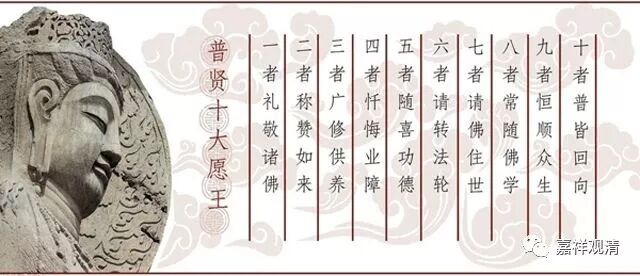
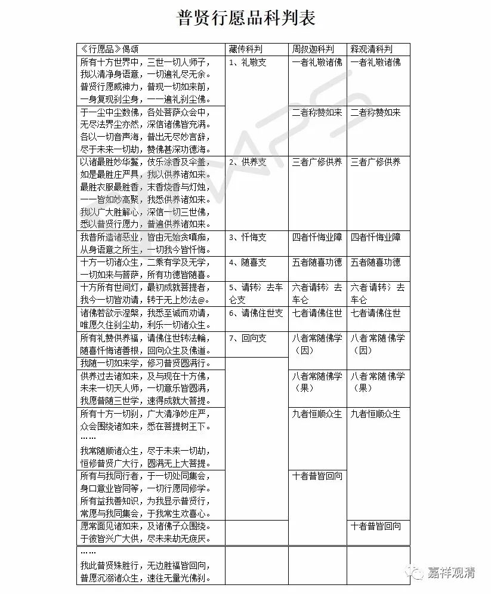

**《普贤行愿品》科判问题表解**

** （作者释观清申明：未授权转抄行为属于盗窃！本文并未授权给“百家号”转载。）**

**
**

关于《华严经·普贤菩萨行愿品》的科判，汉藏不同，一般藏地多取“普贤七支”而汉地多从颂文作“普贤十大愿王”。藏地科判多断至“回向众生及佛道”为止。汉传则有唐圭峰宗密大师录出清凉澄观法师《大普贤行愿品疏》之部分做《普贤行愿品别行疏钞》。但是清凉澄观大师的科判仍旧有些牵强，见周叔迦先生《<普贤行愿品颂疏>序》。

周叔迦先生自己做了个科判，较《清凉疏》更佳。思亦善于藏传所通用之科判。

周叔迦先生把“圆满无上大菩提”之下两颂：“所有与我同行者，于一切处同集会，身口意业皆同等，一切行愿同修学。所有益我善知识，为我显示普贤行，常愿与我同集会，于我常生欢喜心”归入“普皆回向支”，但细观之，此二颂之前一颂为随顺众生之行，后一颂为所以当如此行之原因，故此二颂当并入“恒顺众生支”，“普皆回向”支当从下一颂“愿常面见诸如来”开始算起。

以上是对《华严经·普贤菩萨行愿品》的一点看法，拿出来和大家讨论讨论……

下面给一个科判表，大家看起来可以更方便一些。

** （作者释观清申明：未授权转抄行为属于盗窃！本文并未授权给“百家号”转载。）**

