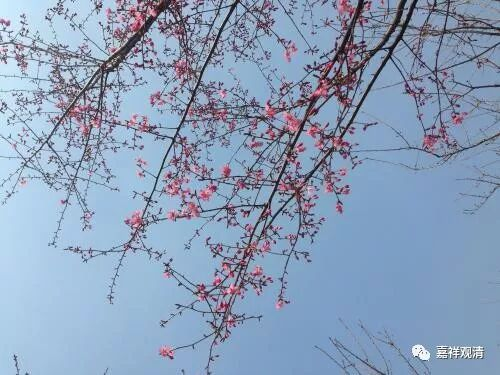

**《菩提速道》045（下）**

** （作者释观清申明：未授权转抄行为属于盗窃！本文并未授权给“百家号”转载。）**

**
**

** “暂且令此五尊明晰显现。而后弥勒、文殊融入能仁身中，两副莲月座也融入能仁的狮子座中。其后，具恩根本上师也化为光明，融入能仁心间，金刚持从上师能仁顶上降至心间，以智慧勇识的姿态安住。”**这个“智勇识”我们现在就不讲了，这个又是密宗的说法了。** “这尊被称为能仁金刚持。（上师与金刚持的）两副莲月座也融入能仁的狮子座中。”**这个是从周围向中间慢慢融入，《掌中解脱》里面说就好像你在玻璃上哈一口气，然后水气就慢慢地从周围向中间消融，前面的部分都这样收摄，收摄成这五尊以后再融入上师善慧能仁金刚持。

** “此时也暂且观想清楚能仁金刚持。而后能仁金刚持也融入自己顶上的具恩根本上师。在自己头顶的狮子莲月日轮坐垫上，体性为自己的具恩根本上师，行相为释迦牟尼佛，身紫磨金色，头具顶髻，一面二臂，右手镇地，左手等持，上托钵盂，甘露盈满，身体庄严地披着褐黄三法衣，相好庄严，以澄净的光明为体，金刚跏趺，安住于自身所发的光蕴之中。心缘于此，”**“心缘”就是想的意思，就是观想自己头顶上面这个。** “略供七支及曼扎，至心祈祷：”**

** **

这个是我们自己脑袋里面观想出来的，是吧？挺奇怪的，这个到底是不是真的存在呢？我也搞不清楚，这是我们把它观想在自己脑袋顶上，它是不是真实存在的呢？我有一位师父，你们很多人都见过，他现在就是每天修四座上师瑜伽的，肯定平时都是把师父观想在脑袋顶上的嘛。我们有个兄弟，以前是练过气功的，你们很多人也认识，他就到拉卜楞寺去，他跟我说，他看到师父头顶上有一尊释迦牟尼佛——上师善逝能仁金刚持。我和某某师父聊过，他说是有可能的。

还有一个传说，上海以前有个有名的啥啥道场的，有人修大威德金刚，据说他进门的时候就直接就被门框给绊住了。这个有点……我也搞不清楚啊。我姑妄说之，你们姑妄听之啊。

但是前面说的师父的那个事情，包括我兄弟亲眼看到的，都是我身边熟识的人。这种东西也确实很奇怪啊！这个是不是另有什么身体呢？那个兄弟的眼睛怎么看到的？他肯定没有天眼的，但是他以前练过什么少林内劲一指禅。他练功的时候也挺用功的，在那站桩，一站就是两小时，浑身湿透，还有过自发动功——他没练过猴拳，进入状态以后自动打猴拳了。……

** **

** （作者释观清申明：未授权转抄行为属于盗窃！本文并未授权给“百家号”转载。）**

