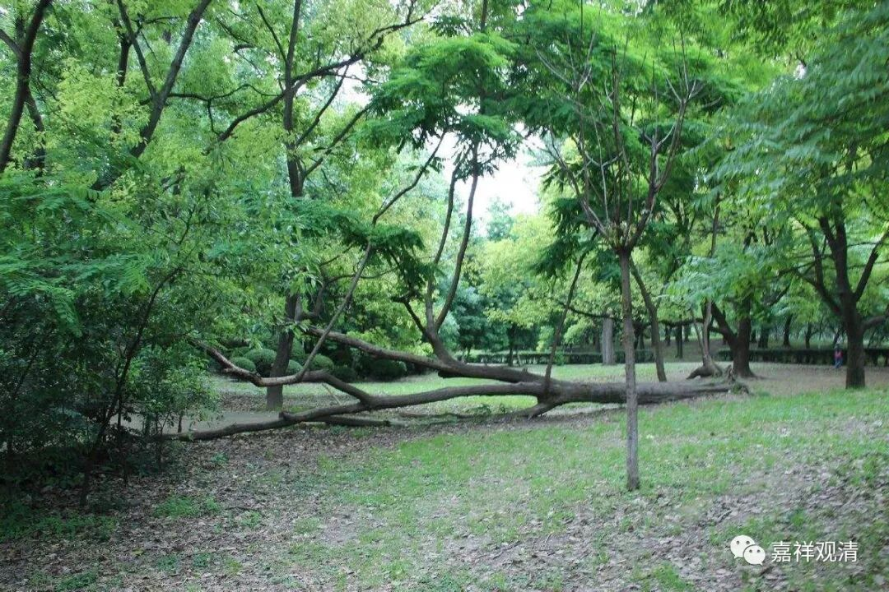

**《菩提速道》046（中）**

** （作者释观清申明：未授权转抄行为属于盗窃！本文并未授权给“百家号”转载。）**

** “心缘于此，略供七支及曼扎，至心祈祷：**

** ‘俱胝圆满妙善所生身，满足无边众生希愿语，**

** 如实观见无余所知意，释迦本师主尊前顶礼！’”**这个是在功课本第21页。

这个之前就在说资粮田：“吉祥大宝根本上师尊，安住于我顶上莲月座，由大恩德之门哀摄受，伏请赐予身语意悉地。”接着就是略供七支及曼扎罗，然后：** “俱胝圆满妙善所生身，满足无边众生希愿语，如实观见无余所知意，释迦本师主尊前顶礼！”**大家看到没有？所以现在讲的就是道次第的仪轨，而且预设大家对这些功课都非常熟悉。

** “此为礼敬颂，然后念诵：**

** ‘实设意现妙供无余献，无始所积罪堕悉忏悔，**

** 凡圣所修诸善皆随喜，乃至轮回未空请住世，**

** 为诸众生广转正法轮，自他善根回向大菩提。’”**

** **

这些功课里面稍微有区别的是什么呢？由于扎仓的不同、寺院的不同，有些念法是不完全一样的、调子不同。因为这些内容是有一个相当于母本的，大致上都差不多，六个扎仓都差不多的。在此中间会有个别的增减，其实基本上都是增，就是我在这里多加一点，你在那里多加一点，或者这段我们平时念三遍的，有些扎仓是念一遍的。

** “然后诵：**

** ‘四洲日月须弥七政宝，’”**“七政宝”就是七宝，不是我们通常讲的七宝，而是玉女宝、金轮宝啊、摩尼宝等等。** “大宝曼扎普贤供云聚，”**多多的供云。** “供奉上师本尊三宝前，恳祈哀悯纳受赐加持！”**其实这里面的很多内容确实有安慰我们世间人的想法，相当于在说：“这是我的供养，您收下吧！”收下以后，又说：“您都已经收下了，请加持我吧！”就这样。

七政宝在经论解释系统里是可以对应七觉支的，这里附上以前做过的一个表格：

七觉支与七政宝对应表

七宝

《中阿含》、《杂阿含A》

《大乘庄严经论》

《瑜伽师地论》

《杂阿含B》

轮宝

念觉支宝

念觉分

念觉支

念觉支

象宝

择法觉支

择法觉分

择法觉支

择法觉支

马宝

精进觉支

精进觉分

精进觉支

精进觉支

摩尼宝

喜觉支

喜觉分

轻安觉支

猗觉支

玉女宝

息觉支

猗觉分

喜觉支

喜觉支

藏臣宝

定觉支

定觉分

定觉支

定觉支

将军宝

舍觉支宝

舍觉分

舍觉支

舍觉支

** （作者释观清申明：未授权转抄行为属于盗窃！本文并未授权给“百家号”转载。）**

