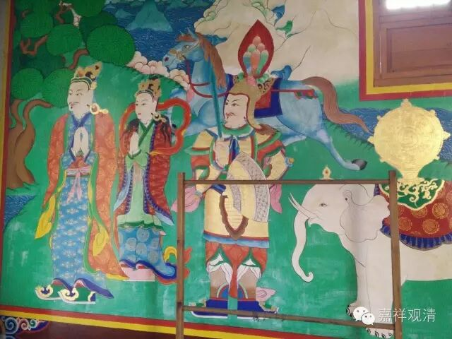

七政宝与七觉支

——《瑜伽师地论》、《大乘庄严经论》与《杂阿含》次序相应关系

** **

藏传佛教的寺院经堂里，常常可以见到有七宝的图案或做成七宝式样的献供，这七宝是：轮宝、象宝、马宝、摩尼宝、玉女宝、藏臣宝、将军宝。据说，七宝是转轮王出现时候“自然生”的宝贝。稍稍解释一下：

轮宝：传说中，它类似飞船或者飞碟，轮王乘此游行天下，甚至可以去天宫……它的原型，就是古时军队里用的战车。

象宝：受训的大象能冲锋陷阵，这可是古代的重型武器，颇似今天的重型坦克。

马宝：也算是武器，它速度快，机动性强——骑兵在古时一直是重要兵种……印度本身很少产马，马比象更稀有。按古印度军队的配置，记得是十（百？）头象，配一匹马。

摩尼宝：传说中能满足所愿，使人“心想事成”。但依阿含里的说法，它更类似于，探照灯，夜晚起到照明的用途。它仅用于娱乐，非用于战事。

玉女宝：就是贤惠的王后。

藏臣宝：据说“主藏臣”的财富能随手而得，取之不尽，用之不竭——也就是极好的财政专家。

将军宝：来之能战、战之能胜的军事统帅。

两千年前，谁若是有了这“七宝”，确实可以成就王霸之业！

自《阿含》起，“轮王七宝”就常常和佛教里常说的“七觉支”并举，如《中阿含经》卷第十一：

“尔时，世尊告诸比丘：若转轮王出於世时，当知便有七宝出世。云何为七？轮宝、象宝、马宝、珠宝、女宝、居士宝、主兵臣宝——是谓为七！若转轮王出於世时。当知有此七宝出世。”

“如是，如来、无所著、等正觉出於世时，当知亦有七觉支宝出於世间。云何为七？念觉支宝、择法觉支、精进觉支、喜觉支、息觉支、定觉支、舍觉支宝——是谓为七！”

《杂阿含经》见卷第二十七：

“尔时，世尊告诸比丘。转轮圣王出世之时，有七宝现於世间：金轮宝、象宝、马宝、神珠宝、玉女宝、主藏臣宝、主兵臣宝。如是……如来出兴於世，有七觉分现於世间，所谓念觉分、择法觉分、精进觉分、喜觉分、猗觉分、定觉分、舍觉分”

这里，“息觉支”和“猗觉分”就是“轻安觉支”，前者是古译、旧译，后是新译。

为什么“七政宝”会与“七觉支”并举，这两者有何相似呢？

《庄严经论》卷第十回答说：

“第一，念觉分，与轮宝相似：未降国土，轮能降故；未伏境界，念能伏故。

第二，择法觉分，与象宝相似：诸国勍敌，象能摧故；分别胜怨，择能破故。

第三，精进觉分，与马宝相似：大地阔边，马速穷故；真如极际，进速觉故。

第四，喜觉分，与珠宝相似：珠光烛幽，王欢极故；法明破暗，心喜满故。

第五，猗觉分，与女宝相似：王受快乐，女摩触故；智脱障恼，猗息恶故。

第六，定觉分，与藏臣宝相似：王有所须，从臣出故；智有所用，从定生故。

第七，舍觉分，与兵宝相似：主兵阅众，弃弱取强，随转轮圣王，所住不疲倦故；菩萨修行，弃恶取善，随无分别智，所住无功用故。

成立七觉分与七宝相似，其义如此。”

《瑜伽师地论》第九十八则说：

如转轮王，于四洲渚，得大自在所获七宝；如是，心王于四圣谛，得大自在，所获真净，七觉支宝，当知亦尔。谓：

于奢摩他、毗钵舍那、双品运转，降伏一切烦恼胜怨；由此义故，初念觉支、犹如轮宝。

所知境相、其量无边，能知智体、亦随广大；由此义故，择法觉支、犹如象宝。

依此速能乃至往彼所行所得殊异胜处；由此义故，精进觉支、犹如马宝。

悦意无罪、最为殊胜；由此义故，其喜觉支、犹如女宝。

身心映彻、有所堪能；由此义故，轻安觉支、如神珠宝。

能办一切所欣求事；由此义故，其定觉支、如藏臣宝。

能摧一切染污法军，能率一切清净法军，能趣无相安隐住处；由此义故，其舍觉支、如将军宝。

列一个表，看看七政宝和七觉支的对应情况：

表一

七宝

《中阿含》、《杂阿含》

《大乘庄严经论》

《瑜伽师地论》

轮宝

念觉支宝

念觉分

念觉支

象宝

择法觉支

择法觉分

择法觉支

马宝

精进觉支

精进觉分

精进觉支

摩尼宝

喜觉支

喜觉分

轻安觉支

玉女宝

息觉支

猗觉分

喜觉支

藏臣宝

定觉支

定觉分

定觉支

将军宝

舍觉支宝

舍觉分

舍觉支

可以看到，《瑜伽师地论》里，“喜觉支”、“轻安觉支”和“摩尼宝”、“玉女宝”的对应关系，与其他三本存在不同。《瑜伽师地论》里女宝对应喜觉支，摩尼宝对应轻安觉支，《庄严经论》和《中阿含》《杂阿含》则正相反——女宝对应轻安觉支，摩尼宝对应喜觉支。

《瑜伽师地论·摄事分·契经事》所解释的“契经”就是《杂阿含经》，而这里所表现出的不同，是所依的传本有异？

细查《杂阿含经·觉支相应》所在的二十六和二十七两卷，发现《杂阿含》自身就出现了“七觉支”顺序的不同：自经七０四至七一0，觉支次序为“念、择法、精进、猗、喜、定、舍”，轻安觉支在前，喜觉支在后；七一一经以后诸经，七觉支次序为“念、择法，精进，喜，猗，定，舍”，喜觉支在前，轻安觉支在后——这恰好就是《瑜伽师地论》和《大乘庄严经论》所依的两种排列次序。

再制一个表就更清楚了。

表二

七宝

《中阿含》、《杂阿含A》

《大乘庄严经论》

《瑜伽师地论》

《杂阿含B》

轮宝

念觉支宝

念觉分

念觉支

念觉支

象宝

择法觉支

择法觉分

择法觉支

择法觉支

马宝

精进觉支

精进觉分

精进觉支

精进觉支

摩尼宝

喜觉支

喜觉分

轻安觉支

猗觉支

玉女宝

息觉支

猗觉分

喜觉支

喜觉支

藏臣宝

定觉支

定觉分

定觉支

定觉支

将军宝

舍觉支宝

舍觉分

舍觉支

舍觉支

由于相应的“七政宝”的次序没有变化，“猗、喜”觉支的次序一变，两者间的对应关系也就出现了差异，并分别为《大乘庄严经论》和《瑜伽师地论》所本。

