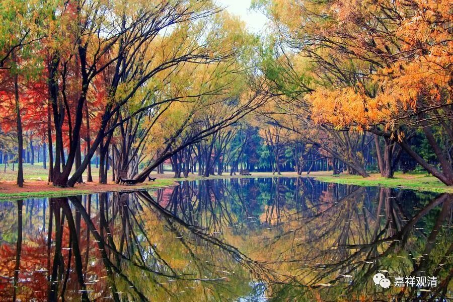

**四种“一切”与心所法的分类**

** （作者释观清申明：未授权转抄行为属于盗窃！本文并未授权给“百家号”转载。）**

**
**

……五遍行心所，遍生起于三界、九地、五趣、三性，与一切心心所俱起，若起其一，余必俱起；而别境心所，仅遍生起于三界、九地、五趣、三性，非与一切心心所俱起，若起其一，余不必俱（仅为“或俱”）。瑜伽行派之通说如是。

唯识宗提出“四种一切”不是没有意义的，他是为了对心所法做出差异性的分类（六类或五类）：遍行具备全部四种一切；别境具备一切处、一切地；善心所可谓具“一切地”（此“地”指有寻有伺地等三地）；根本烦恼及随烦恼此四种一切俱无；不定心所则唯依一切处生。

** **

** 《瑜伽师地论》卷三云：**

問：如是諸心所，幾依一切處心生？一切地、一切時、一切耶？

答：五。謂作意等，思為後邊。

幾依一切處心生？一切地。非一切時。非一切耶？

答：亦五。謂欲等，慧為後邊。

幾唯依善，非一切處心生，然一切地，非一切時，非一切耶？

答：謂信等，不害為後邊。

幾唯依染污，非一切處心生，非一切地，非一切時，非一切耶？

答：謂貪等，不正知為後邊。

幾依一切處心生，非一切地，非一切時，非一切耶？

答：謂惡作等，伺為後邊。

** 《瑜伽师地论遁伦记》**

一切处者。《唯识》第五解云，谓三性处。

一切地者，有二义：一云有寻等三地；二云九地，谓从欲界乃至非想。

一切时者，心生必有。

一切耶者，随其自位，起一必俱。

遍行具四。

别境非後二。

善十一中，非一切处，唯善性故。非一切时者，非心生时则皆起故。非一切耶者，虽十并头起，而轻安不定故。一切地者。有义遍九地心，定加行亦名定地，彼亦微有调畅义故，由斯欲界亦有“轻安”。有义：不然。论说。欲界由阙轻安，名不定地。而言通“一切”者，有寻伺等三地皆有故。然五十五云善心起时有六位者。据强为论故。

染四皆无。此文总说根本及随烦恼合名染位。

不定唯一。谓一切性。

见下表

六类心所与四“一切”

五遍行

五别境

善心所

根本烦恼

随烦恼

不定心所

一切地

+

+

+

-

-

-

一切处

+

+

-

-

-

+

一切时

+

-

-

-

-

-

一切耶

+

-

-

-

-

-

**
**

** （作者释观清申明：未授权转抄行为属于盗窃！本文并未授权给“百家号”转载。）**

