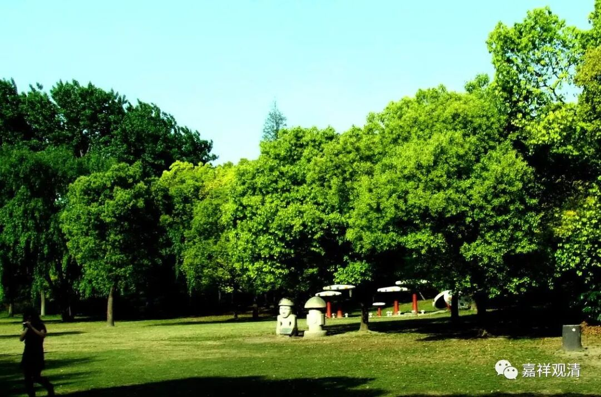

**《菩提速道》046（下）**

** （作者释观清申明：未授权转抄行为属于盗窃！本文并未授权给“百家号”转载。）**

**
**

** “四身体性上师殊胜天，能仁金刚持前诚祈祷！**

** 离障法身体性上师天，能仁金刚持前诚祈祷！**

** 大乐报身体性上师天，能仁金刚持前诚祈祷！**

** 种种化身体性上师天，能仁金刚持前诚祈祷！**

** 遍摄师尊上师殊胜天，能仁金刚持前诚祈祷！**

** 遍摄本尊上师殊胜天，能仁金刚持前诚祈祷！**

** 遍摄佛陀上师殊胜天，能仁金刚持前诚祈祷！**

** 遍摄正法上师殊胜天，能仁金刚持前诚祈祷！**

** 遍摄僧伽上师殊胜天，能仁金刚持前诚祈祷！**

** 遍摄空行上师殊胜天，能仁金刚持前诚祈祷！**

** 遍摄护法上师殊胜天，能仁金刚持前诚祈祷！**

** 遍摄依处上师殊胜天，能仁金刚持前诚祈祷！”**

** **

上师呢，是遍摄这一切的。他遍摄了正法，遍摄了僧伽，遍摄了空行，遍摄了诸佛世尊等等。这个上师就是普遍含摄了这一切的我们礼敬的对象，包括三宝。所以我观想一个就可以了。

** “我及一切慈母有情生于轮回之中，备尝种种剧烈长时的极大痛苦，”**这句话其实是真话哦，不过一般我们真的不认为是真话，只是念念而已。我们并没有觉得是极大的痛苦，而且还乐此不疲。就像这两天十一期间，你明明知道开车出去肯定要堵在路上的，却还是要出去，只是带上方便面，带上可以煮的东西，看见高速公路上堵车了，就在路边上把桌子呀、凳子呀都摆开，大家开吃了，是吧？明明知道开车出去多半是要堵的，还是去了，这叫什么？明知山有虎，偏向虎山行。

** “皆因未以意乐加行如理地依止善知识所导致的，”**这些痛苦怎么导致的呢？是因为不听话嘛。比如说我是世间的善知识，那就说：“哎呦！十一别出去了，我去年去过了，路上都是XX样子。”这里要表达的就是善知识，他是过来人，可是你却不听：“哎呀！大家都这样，没问题的。”结果很有趣哦。据说前天上海的迪士尼乐园没人，因为大家都以为迪士尼会被挤爆，都跑到外面去了，结果迪士尼反而没人。

这些痛苦都是因为不如理地依止善知识所导致的。其实依止善知识这个事情随便想想都是很简单的，真的是很多事情都要依止善知识，就连走个路也要依止善知识。我们今天走路的时候都要找一个好一点的软件，像百度地图这样，按图索骥，我们是痕迹的“迹”了，一般的软件你也不想要嘛，这就叫依止善知识嘛。做饭也是、健身也是、上菜场买菜也是、看病也是，都需要依止善知识，依止善知识就是捷径！

** （作者释观清申明：未授权转抄行为属于盗窃！本文并未授权给“百家号”转载。）**

