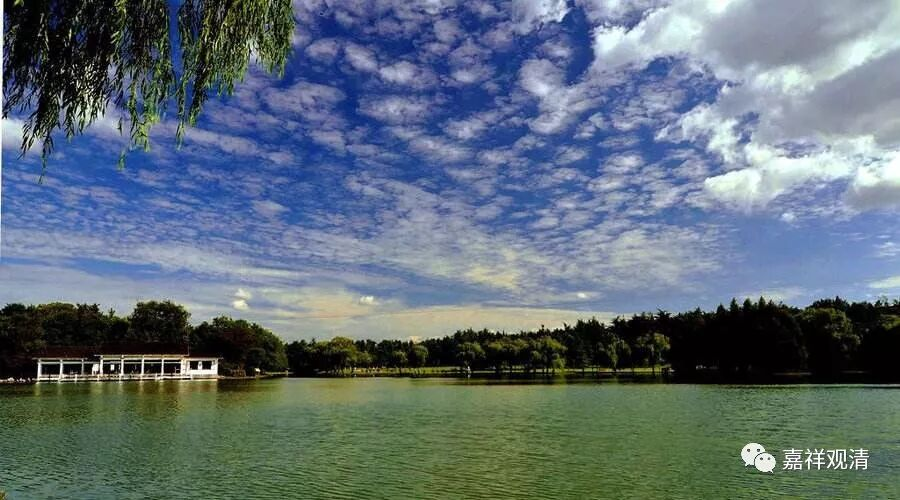

关于心所的假实

**（作者释观清申明：未授权转抄行为属于盗窃！本文并未授权给“百家号”转载。）**

**
**

毗婆沙师在北传系统中为声闻乘之代表，阿毗达摩论典极其丰富。由于有部在历史上活跃的时间跨度很大（上千年），所以对他的心所方面的论述做简单总结有相当之难度。这里略依《俱舍论》和《顺正理论》谈谈毗婆沙师对心所的“假实观”。

有部，若依《俱舍》之总结，则有四十六心所：大地法有十；大善地法有十；大烦恼地法有六；大不善地法有二；小烦恼地法有十；不定地法有八。若依顺正理师，则在五地之外更加欣、厌二心所（因为欣、厌二法不遍善心故），共四十八心所。

此四十六或四十八心所，不论是否是等流性，皆别有体。有部不单列“五不正见”及“无痴”，因为他们认为五染見及无痴都是慧心所。勉强（按瑜伽行派的习惯）说的话，可以认为毗婆沙师许此六（或二）心所为假法。

在有部的基础上，大乘瑜伽行派继续讨论心所的假实问题。

若依《大乘阿毗达摩集论》，共成立五十五种心所，其中《成唯识论》之“不正见”被开为“萨迦耶见、邪见、边执见、见取见、戒禁取见”五，《集论》与《成唯识论》在心所的数量安立上实质并无不同。

《集论》的心所法里，有三十三（或二十九）种分位假立之法：善心所有四：无痴、不放逸、行舍、不害；根本烦恼有五（或一），即“不正见”（萨迦耶见、邪见、边执见、见取见、戒禁取见）；小随烦恼全部，有十：忿、恨、覆、恼、嫉、悭、诳、谄、憍、害；中随烦恼全部，有二：无惭、无愧；大随烦恼全部，有八：惛沈、掉举、不信、懈怠、放逸、失念；散乱、不正知；不定有四：眠、悔、寻、伺。除此以外的二十二法皆是有实体之心所法。

与《俱舍论》不同，《集论》系统认为，二十个随烦恼中，不论其属于根本烦恼的分位差别还是根本烦恼的等流，全部属于假法（《俱舍》认为都是实法）。

依《成唯识论》，立五十一种心所，其中属于分位假立之法有十九：善心所有三：不放逸、行舍、不害；根本烦恼有一，即“见”；小随烦恼全部，有十：忿、恨、覆、恼、嫉、悭、诳、谄、憍、害；大随烦恼有三：失念、不正知、放逸三；不定有二：寻、伺。其余三十二个心所法皆实有。

《成唯识论》认为，随烦恼中，属于根本烦恼的“分位差别”的心所有十三个，其中小随烦恼有十个：忿、恨、覆、恼、嫉、悭、诳、谄、憍、害；大随烦恼有三个：失念、不正知、放逸。此十三个随烦恼心所法，《成唯识论》认为是是假有。但是，大随烦恼中其余七个心所法：无惭、无愧、掉举、惛沈、散乱、不信、懈怠，虽是“根本烦恼等流”，而亦别有实体。《成唯识论》云：

“前云随其烦恼分位差别、等流性故者，义现此尔。盖忿、恨等十并失念、不正知、放逸，此十三法，乃根本家差别分位也，若无惭、无愧、掉举、惛沈、散乱、不信、懈怠，此之七法，乃根本家等流性故。

或云：‘此七既别有体，何名等流？’

曰：‘根本为因，此方生故，名等流也。’”

这是和《俱舍》、《集论》都不同的，他似乎正站在了《俱舍》和《集论》的中间。

《阿毗达摩俱舍论》

《大乘阿毗达摩集论》

《成唯识论》

** 作意**

实法

实法

实法

** 触**

实法

实法

实法

** 受**

实法

实法

实法

** 想**

实法

实法

实法

** 思**

实法

实法

实法

** 欲**

实法

实法

实法

** 胜解**

实法

实法

实法

** 念**

实法

实法

实法

** 等持（三摩地）**

实法

实法

实法

** 慧**

实法

实法

实法

** 信**

实法

实法

实法

** 惭**

实法

实法

实法

** 愧**

实法

实法

实法

** 无贪**

实法

实法

实法

** 无瞋**

实法

实法

实法

** 无痴**

假法

假法

实法

** 精进**

实法

实法

实法

** 轻安**

实法

实法

实法

** 不放逸**

实法

假法

假法

** 舍（行舍）**

实法

假法

假法

** 不害**

实法

假法

假法

** 贪**

实法

实法

实法

** 瞋**

实法

实法

实法

** 慢**

实法

实法

实法

** 无明（痴）**

实法

实法

实法

** 见（不正见）**

假法

假法

假法

假法

假法

假法

假法

假法

假法

假法

假法

假法

假法

假法

假法

** 疑**

实法

实法

实法

** 忿**

实法

假法

假法

** 恨**

实法

假法

假法

** 覆**

实法

假法

假法

** 恼**

实法

假法

假法

** 嫉**

实法

假法

假法

** 悭**

实法

假法

假法

** 诳**

实法

假法

假法

** 谄**

实法

假法

假法

** 憍**

实法

假法

假法

** 害**

实法

假法

假法

** 无惭**

实法

假法

实法

** 无愧**

实法

假法

实法

** 惛沈**

实法

假法

实法

** 掉举**

实法

假法

实法

** 不信**

实法

假法

实法

** 懈怠**

实法

假法

实法

** 放逸**

实法

假法

假法

** 失念（忘念）**

假法

假法

** 心乱（散乱）**

假法

实法

** 不正知**

假法

假法

** 恶作（悔）**

实法

假法

实法

** 睡眠（眠）**

实法

假法

实法

** 寻**

实法

假法

假法

** 伺**

实法

假法

假法

** （作者释观清申明：未授权转抄行为属于盗窃！本文并未授权给“百家号”转载。）**

