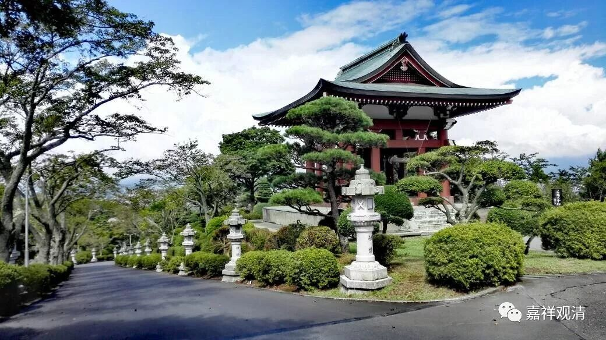

**《菩提速道》058（中）**

** （作者释观清申明：未授权转抄行为属于盗窃！本文并未授权给“百家号”转载。）**

**
**

好，我们往下看。

** “正行分四： **

** 戊一、依止善知识的利益。**

** 戊二、不依止的过患。**

** 戊三、意乐依止法。**

** 戊四、加行依止法。”**

** **

这就是在劝你要依止善知识嘛，就开始给你洗脑——依止善知识的好处在哪里，不依止的坏处在哪里。这和医生对病人讲的东西一样了，你吃这个药的好处在哪里——吃了就控制血糖，不吃的坏处又在哪里——会有毛细血管的病变、眼底的病变，最后可能失明，最后可能有断疽——脚趾头一个个感染坏死……这些情况，你自己想吧。

但是一般的病人是不怎么听医生话的，如果不听医生的话，后面真的会很惨。你看，现在这些糖尿病人很多都会脚指头一个一个地断掉，是吧？（我有个高中同学就是搞这个课题的，问我们中医有没有办法）眼睛全部失明，真的很惨，而且糖尿病人连抓痒都不太好抓……这些都是我们不依止善知识的过患，都是不听师父的话或者不听好医生的话造成的。

** “初者，观上师能仁心间化现出与自己亲具法缘的诸尊上师，安住于面前虚空中，心中这样思惟：**

** 如经论中说，由依善知识故，得近佛地；令诸佛欢喜；生生不乏善知识摄受；不堕恶趣；不为诸恶业烦恼所败；不违菩萨大行常生随念，由此诸功德聚渐次增长；得成现前、究竟一切大义。”**

** **

这个就是依止善知识的好处，“得近佛地”就是成佛很快。刚开始学可以把这些科判背下来。

** “又说，由恭敬、承侍善知识故，当于恶趣所受诸苦，即于现世身心少受损恼，或于梦中而领受之，昔诸恶业即得拔除令尽；”**

就是说，会有这些好处，比如说什么好处呢？汉地经常讲的，叫作“重报轻受”，会有这种情况发生。

“** 且能映蔽以诸珍财供养十方无量诸佛所得善根，有如是等无边利益。”**这个又怎么说呢？是一根引诱你的香蕉，告诉你依止了善知识有什么好处。第一，比供养十方的诸佛菩萨所得的善根有更多的好处，但实际上我们现在并没有供养十方佛菩萨的能力，而师父在面前使你得到的利益是最现前的、最近的，就有这样无边的利益。

之前我们谈到“佛菩萨为什么没有先前显现”，在这里我们要说：你先抓住离你最近的手，他就是你师父递过来的——师父，你是离我最近的佛！

** （作者释观清申明：未授权转抄行为属于盗窃！本文并未授权给“百家号”转载。）**

