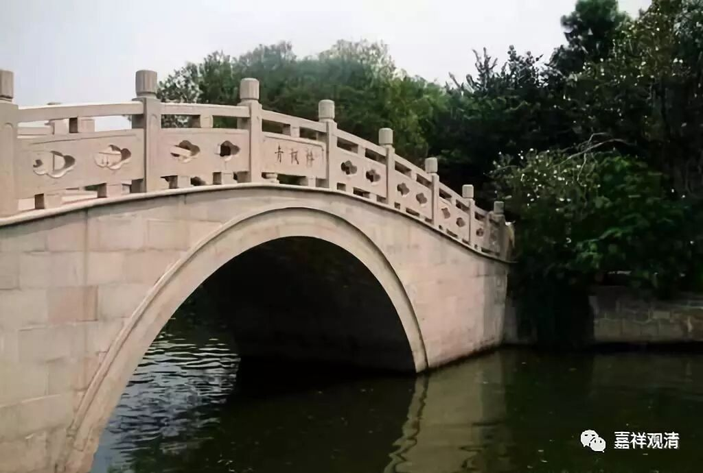

**《菩提速道》048（下）**

** “此中是说以意乐加行如理依止善知识的利益：**

** 一、得以趋近佛陀宝位。**

** 如龙树怙主的《五次第》中说：”**这个应该是密宗里面的《五次第明灯论》。

** **

** “‘舍余一切供，正趣供上师，**

** 由令师欢喜，得获遍知智。’”**

** **

因为师父高兴了，你学到的东西就会多。我们一直在开玩笑地讲，在师父面前应该表现得像一个汉奸，而不是一个老八路，是吧？如果在师父面前表现得腰杆挺直的，那是老八路的形象，而我们应该像看到的很多格西们一样，在自己的师父面前，腰永远都是弯的。而我们呢，却好像觉得不好意思，看见别人弯了，也就跟着弯一弯，只要一有机会就马上抬起来。我们是觉得自己的面子很重要，而弯腰不重要。当你觉得对别人有所求的时候也是一样，我们一般就会放低一下身子。当你在师父面前有所求的时候，你也会放低一些身段。那么，让师父欢喜就会“得获遍知智”。遍知就是佛陀，遍知智就是佛陀的智慧。这个应该怎么理解呢？就是要让师父高兴，反过来呢，别给他添麻烦。

** “二、能令诸佛欢喜。**

** 自己未如理守护三昧耶以及戒律，虽然供养诸佛菩萨可以获得供养的利益，但得不到诸佛菩萨欢喜享用的利益。若能按依止法如理供养一位上师，一切诸佛菩萨都会不请自来，安住于那位上师的身中，欢喜享用所供的物品。”**

** **

这个呢，我不知道到底是怎么样的，但是我觉得还是类似于方便法的。你看，他的道理很浅显，浅显得好像不是给高知的教法，因为实在是太简单了。就是说，供养了师父以后，佛菩萨都会在师父的身体里面，享受蛋白质啊、碳水化合物啊等等，所以他们就欢喜了。这个太世俗了吧？可能对世俗的人就是这样的教法吧。那么，按这个说法，就会得到两份利益——师父也高兴，佛菩萨也高兴。

** “如《文殊口授》中说：**

** ‘于此合义者，我住彼身中，受诸行者供，欢喜故自心，业障得清净。’”**这说的是什么呢？佛菩萨住在上师的身中：“你来供养他的时候呢，你师父能够接受，我也能够接受你的供养。”是这样的背景。师父们自己有没有认识到，我不知道。

这个教法感觉好像挺简单的，不过密宗里面很多教法就是这样简单的。我对密宗也不了解，基本算是个外行，在我这个外行人看来，好像就是技术含量不算很高的那个样子。我个人感觉显宗的止观方面的技术含量很高，经论的技术含量也很高。

当然，这里所说的肯定都是正确的，不过这些正确的说法，是究竟的说法呢，还是方便的说法呢？Emmmmmm，看起来好像是为了下面的这些弟子喜欢而说的吧？

