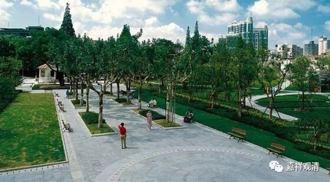

**色界天有几？**

《俱舍》说：色界有十七天：

初禅天有三：梵众天、梵辅天、大梵天；

二禅天有三：少光天、无量光天，极光净天（就是常说的“光音天”）；

三禅天有三：少净天、无量净天、遍净天；

四禅天有八，分二：

其初有三：无云天、福生天、广果天；

四禅天之出世间“五净居天”，为三果以上圣者所居，有五：无烦天、无热天、善现天、善见天、色究竟天。（大乘所说报身佛之“色究竟天净土”在色究竟天之高胜处。）

三四十二，加五净居天，共十七天。

《俱舍》在这里取经部师说。通常北传也以这一说为常见。

若按有部，则许色界唯十六天，即初禅天中少“大梵天”，有部认为“大梵天”所居之处和“梵辅天”没有大的区别，仅仅是略为高胜而已。

上座部许有十八天，在十七天的基础上，再加“无想天”，在第四禅，和“广果天”各别独立。其他两部不加“无想天”的原因是认为摄在“广果天”里了。

在《般若经》里则还至少见有一种许法。

《大品般若》卷九：

** “梵众天、梵辅天、梵会天、大梵天、光天、少光天、无量光天、光音天、净天、少净天、无量净天、遍净天、无荫行天、福德天、广果天……净居诸天，所谓无诳天、无热天、妙见天、喜见天、色究竟天……”**

《小品般若》卷九：

** “梵世诸天，梵辅天、梵众天、大梵天、光天、少光天、无量光天、光音天、净天、少净天、无量净天、遍净天、无阴天、福生天、广果天、无广天、无热天、妙见天、善见天、无小天上诸天，皆敬礼是行般若波罗蜜菩萨。”**

暂不谈翻译名词上的差异，这里，《大品》和《小品》般若都在初、二、三禅天各多出一个天——初禅天多了“梵世（会）天”，二禅天多了“光天”，三禅天多了“净天”，这样合则色界有二十天。

或者可以理解为“梵世天”（《大品》的“梵众天”）与“梵辅天、梵众天（《大品》的“梵会天”）、大梵天”为总别关系，“梵世天”为总，“梵辅天、梵众天、大梵天”为别。“光天”与“少光天、无量光天、光音天”、“净天”与“少净天、无量净天、遍净天”也是同样的总别关系，这样似乎容易和通说（“十七天”说）相对应。当然这里只是一个猜测……

