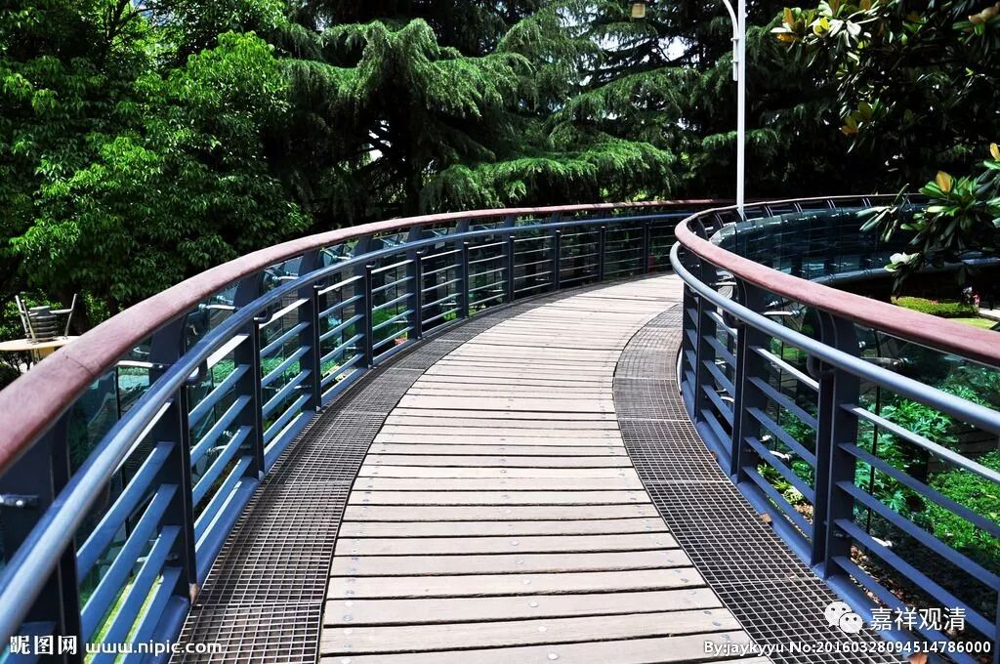

**《菩提速道》讲记049（上）**

** **

** “三、生生不乏善知识摄受。**

** 博多瓦大师的《蓝色手册》中说：**

** ‘对自己想要求法的上师须数数观察，一旦作为自己的上师后，就要恭敬顶戴，如果能这样，未来不会缺乏上师的摄受，因为这是诸业作而不失的法性。’”**

类似的，我们也有一句古话——一日为师，终生为父。“天地君亲师”，那是放在堂屋最中间的排位，是要绝对恭敬的。我们寺院在江西，村里走走，你会看到正屋里中间常贴着这么一张纸——“** 天地国亲师**”，新时代了，君，皇帝没了，改了国家了。

拜了师父以后，就得当师父供着，老法里都有这个讲究。师父做得再有问题，徒弟这里是有底线的。前几年郭德纲和俩弟子闹了很大的动静，按老规矩。先不说郭德纲，俩徒弟这么使劲闹，就没法在江湖上立足了——江湖上见不得这种货色。哪怕师父这里天大的错，按前人的智慧，你也只有天山遁了。“遁”，《易经》说，“亨，小利贞。”走就行了，嘴缝上，还有点好的结局。绝不能不认这个师父、更不能“断绝关系”。说一句废话——师父就是师父！

按规矩来，照因果办，那样正确的依止师父，将来会遇到好的师父。现实上也是这样——跟你十年八年的师父你都反了，还有谁敢收你做徒弟呢——他还没郭德纲跟你处的时间长呢……

那么，对我们来说呢，这些条目不完全一定是要这样思维的，这里只是给你一个例证，或者是一些经教的证明。你如果能力一般的话，就按照这个背下来，八条，照着思维就行。如果你能力够的话，就按照这个来广大地思维也行，甚至你再多加几条也未见得不可，或者你自己再填充一些其他的教理，也未尝不可——当然，要看你的水平多高了。

** “四、不为诸恶业烦恼所败。”**

** **

这个从上下文来看，显然是不了义说，显然是别时意趣。你依止善知识本身不会马上就成为“不为诸恶业烦恼所败”，但是它会是“不为诸恶业烦恼所败”的因，所以是“别时意趣”。今天依止了善知识，以后再这样照他的教导慢慢地修行下去的话，就会“不为诸恶业烦恼所败”。

有人拜了师父，光知道灌顶、追着后面像追星一样，师父的教言却不去实践，这，不叫如理依止善知识。善知识最重要的作用体现在语功德，语言教说的目的就是让你去实践……当然了，也许对“上师追星族”而言，他今天烦恼心的追星，就是下一世得遇善知识的因——也是，有，总比啥都没有强！

