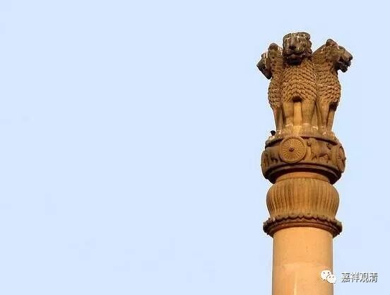

** 泰国纪行（一）金地**

第一次来泰国。

我们是在泰国曼谷素万那普机场落地的。素万那普，是曼谷的新机场。

素万那普国际机场(Suvarnabhumi International Airport)，又称为新曼谷国际机场，其“素万那普”，即Suvarnabhumi，这是一个梵文，翻译过来便是“金地”。bhumi，就是供曼扎的时候那个“嗡 班扎普米 阿吽……”的“普米”，“班扎”，梵文vajra，就是金刚，“普米”，就是bhumi，地。素万那，suvarna，su是妙、好；varna是色；胜色，就是金（玄奘法师翻译为“生色”的，指金子，应该就是这个suvarna。）。素万那普（米），就是“金地”了。

原来曼谷新机场叫“金地机场”。这个“金地”，可是有点来由的。

（印度电影《阿育王》）

佛教历史上有一位重要的“法王”——阿育王。他在佛灭后两百年左右出世，先用武力野蛮征服了全印度，后来放下屠刀，崇信佛教。在他的治下，佛教向各地派出传教团，其中就有“金地”。一般认为，“金地”就是今天的泰国。

（阿育王石柱）

据南传史料记载，他向西北印度克什米尔、健驮罗派出大师末阐提，往南印度摩醯娑慢陀罗国的是大天，往印度河西北婆那婆私国的是勒弃多，往旁遮普西部阿波兰多伽国的是法藏，往大夏地区臾那世界国的是摩诃勒弃多，往雪山附近的是末示摩，往金地国的是须那迦、郁多罗，往斯里兰卡的是摩哂陀、僧伽密多。（其中，被派往斯里兰卡的比丘摩哂陀据说是阿育王的儿子。）

泰国是一个佛教国家，其曼谷新机场取名“金地”（素万那普suvarnabhumi），是一个充满佛教历史味道的名字……

