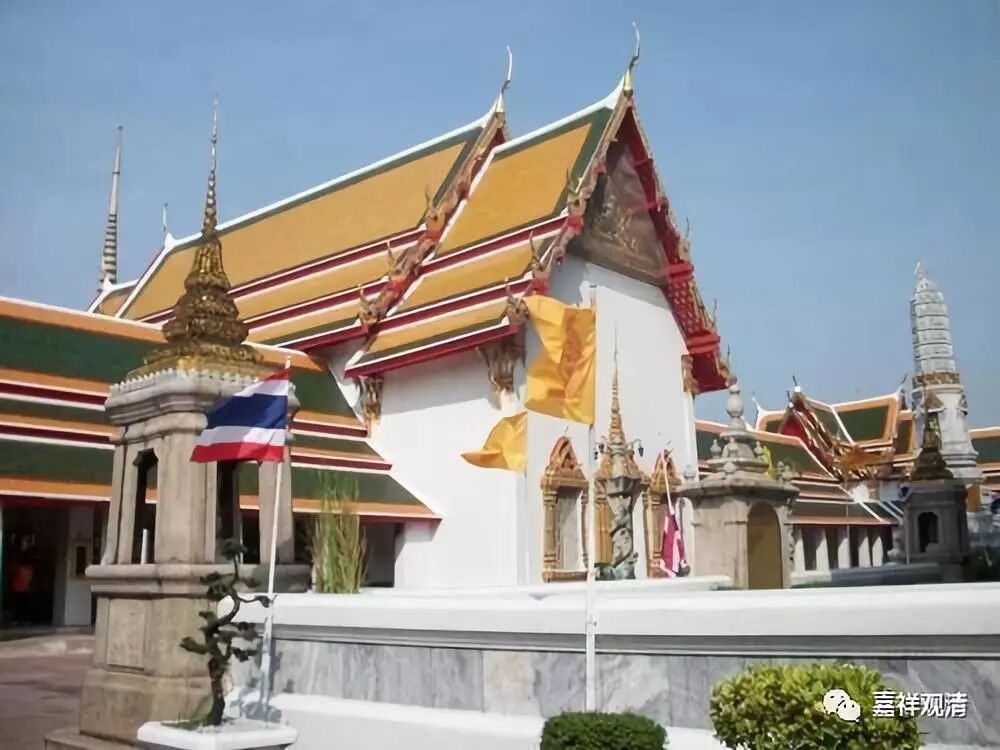

**《菩提速道》讲记051（上）**

** “宗喀巴大师说：‘肆意於上师作毁谤等，而妄言勤于闻思修者，实为开启恶趣之门。’”**有种人对上师做毁谤等事，然后还自己说自己修闻思很好，这个就不要谈了，假的。

** “‘如《金刚心要庄严续》中说：“若人谤上师，虽勤最胜续，舍睡眠杂乱，千劫中勤修，亦修地狱等。”’”**如果你诽谤上师，你离开了上师还说这个上师有问题、不好等等，哪怕你再努力，就算是修最最殊胜的密续修法，你跟修地狱是没区别的，你再修也肯定是去地狱的。

如果结合太虚法师的话，那就是人格都有问题了。“人圆即佛成”，人都不“圆”，人格都没做好，做一个好人的格局都没有，你说你能成佛？！难道有一个佛，他连好人的格局都没有吗？！这个因果绝不能是这样的，绝不能说你舍弃了上师、诽谤了上师，你还能成佛。有这种因果的话，佛教就真的不称为佛教了，佛教以后也没有办法弘扬了。

** “另外，还说到，曾作无间恶业，诽谤正法，或犯别解脱戒四根本等的极重罪人，于此金刚乘中亦可获得殊胜成就，”**就是也有忏悔的方法，忏悔之后也可以获得成就。** “但是，若是至心诽谤阿阇黎的人，即便千劫勤修，终无任何成就，他的朋友也不会成就。”**“至心诽谤”，就是存心造恶，这样一句话，就把他周围的门全部关掉了。“他的朋友也不会有成就”，我理解为就是和他一起、参与诽谤的那些人——他的伙伴们。一般说起来，和他同坛灌顶的人就算的，有这个说法——那也太惨了。

我们去参加灌顶的时候，一定要谨慎一点哦。我看到一些不如法的人参加灌顶，吓都吓死了。有些人喜欢挤进来灌顶，却连佛法ABC都不知道的，只是听说“灌顶成佛快”就跑来灌顶，这种人要跟我一起参加这类法会，呃，我是怎么也不会进场的，你就是再给我30斤金子我都不会去跟他做师兄弟——我这么财迷的人，都不会进这个坛场。碰到这种情况，你可以选择不去参加。

